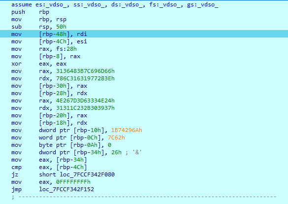
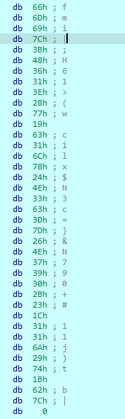

# Offshift x and or Write Up

## Details:
Points: 500

Jeopardy style CTF

Category: Reversing

## Write up:

The first thing I did once downloading the file was run the file and then check to see what type of file it was:

``` bash
./x-and-or   

Enter the flag: 
```


``` bash
file x-and-or     

x-and-or: ELF 64-bit LSB shared object, x86-64, version 1 (SYSV), dynamically linked, interpreter /lib64/ld-linux-x86-64.so.2, BuildID[sha1]=d75c2db8d7b1c77fd65762741f73b19aba4f2815, for GNU/Linux 3.2.0, not stripped
```

Seeing as this was an ELF 64 bit file I opened the file in IDA and navigated to the pseudocode for the main function:

``` c
int __cdecl main(int argc, const char **argv, const char **envp)
{
  char s[8]; // [rsp+Ch] [rbp-114h] BYREF
  unsigned __int64 v5; // [rsp+118h] [rbp-8h]

  v5 = __readfsqword('(');
  printf("Enter the flag: ");
  fgets(&s[4], 256, _bss_start);
  s[strcspn(&s[4], "\r\n") + 4] = 0;
  *(_DWORD *)s = strnlen(&s[4], '\x01\0');
  if ( (unsigned int)code(&s[4], *(unsigned int *)s) )
    puts("That is not the flag.");
  else
    puts("That is the flag!!!!");
  return 0;
}
```

The main function prints out "Enter the flag:" and then reads in what the user writes. Since this file links a .so file I needed to debug through in order to see the rest of the code so I set up the remote linux debugger and set a breakpoint on the if statement.

Once prompted for the flag I simply put in flag{, this way I would know the length and it would match the flag format. Once the debugger hit the if statement I stepped into the called function and got the following assembly:



Looking through the values I noticed that rdi contained the string I inputted (flag{) and esi contained the length of the string (5). 

xor eax, eax simply sets eax to 0 since anything xor'ed with itself it 0.

The assembly then goes through and puts a string into rbp. After stepping through up until the cmp instruction I went to rbp-30h and saw:



I then extracted this under the assumption that this was the encrypted password.

``` python
enc = [0x66, 0x6D, 0x69, 0x7C, 0x3B, 0x48, 0x36, 0x31, 0x3E, 0x28, 0x77, 0x19, 0x63, 0x31, 0x6C, 0x78, 0x24, 0x4E, 0x33, 0x63, 0x3D, 0x7D, 0x26, 0x4E, 0x37, 0x39, 0x30, 0x2B, 0x23, 0x1C, 0x31, 0x31, 0x6A, 0x29, 0x74, 0x1B, 0x62, 0x7C]
```

I then went back to the assembly. The cmp compared eax to [rbp-4Ch]. After some looking I noticed that [rbp-4Ch] contained 5 (string length) while eax contained 26h, meaning the flag should be 38 characters long. This reaffirmed my suspicions that enc was the encrypted password as end was 38 characters long.

I then set eax to be 5 so I could continue debugging and jumped through a few functions till I reached:

```
loc_7F6C28CE808C:                       ; CODE XREF: debug003:00007F6C28CE8147↓j
debug003:00007F6C28CE808C     mov     eax, [rbp-38h]
debug003:00007F6C28CE808F     cdqe
debug003:00007F6C28CE8091     movzx   eax, byte ptr [rbp+rax-30h]
debug003:00007F6C28CE8096     movsx   edi, al
debug003:00007F6C28CE8099     mov     edx, [rbp-38h]
debug003:00007F6C28CE809C     movsxd  rax, edx
debug003:00007F6C28CE809F     imul    rax, 2AAAAAABh
debug003:00007F6C28CE80A6     shr     rax, 20h
debug003:00007F6C28CE80AA     mov     esi, edx
debug003:00007F6C28CE80AC     sar     esi, 1Fh
debug003:00007F6C28CE80AF     mov     ecx, eax
debug003:00007F6C28CE80B1     sub     ecx, esi
debug003:00007F6C28CE80B3     mov     eax, ecx
debug003:00007F6C28CE80B5     add     eax, eax
debug003:00007F6C28CE80B7     add     eax, ecx
debug003:00007F6C28CE80B9     add     eax, eax
debug003:00007F6C28CE80BB     mov     ecx, edx
debug003:00007F6C28CE80BD     sub     ecx, eax
debug003:00007F6C28CE80BF     mov     esi, [rbp-38h]
debug003:00007F6C28CE80C2     movsxd  rax, esi
debug003:00007F6C28CE80C5     imul    rax, 2AAAAAABh
debug003:00007F6C28CE80CC     shr     rax, 20h
debug003:00007F6C28CE80D0     mov     r8d, esi
debug003:00007F6C28CE80D3     sar     r8d, 1Fh
debug003:00007F6C28CE80D7     mov     edx, eax
debug003:00007F6C28CE80D9     sub     edx, r8d
debug003:00007F6C28CE80DC     mov     eax, edx
debug003:00007F6C28CE80DE     add     eax, eax
debug003:00007F6C28CE80E0     add     eax, edx
debug003:00007F6C28CE80E2     add     eax, eax
debug003:00007F6C28CE80E4     sub     esi, eax
debug003:00007F6C28CE80E6     mov     edx, esi
debug003:00007F6C28CE80E8     mov     esi, ecx
debug003:00007F6C28CE80EA     imul    esi, edx
debug003:00007F6C28CE80ED     mov     ecx, [rbp-38h]
debug003:00007F6C28CE80F0     movsxd  rax, ecx
debug003:00007F6C28CE80F3     imul    rax, 2AAAAAABh
debug003:00007F6C28CE80FA     shr     rax, 20h
debug003:00007F6C28CE80FE     mov     r8d, ecx
debug003:00007F6C28CE8101     sar     r8d, 1Fh
debug003:00007F6C28CE8105     mov     edx, eax
debug003:00007F6C28CE8107     sub     edx, r8d
debug003:00007F6C28CE810A     mov     eax, edx
debug003:00007F6C28CE810C     add     eax, eax
debug003:00007F6C28CE810E     add     eax, edx
debug003:00007F6C28CE8110     add     eax, eax
debug003:00007F6C28CE8112     sub     ecx, eax
debug003:00007F6C28CE8114     mov     edx, ecx
debug003:00007F6C28CE8116     mov     eax, esi
debug003:00007F6C28CE8118     imul    eax, edx
debug003:00007F6C28CE811B     xor     edi, eax
debug003:00007F6C28CE811D     mov     edx, edi
debug003:00007F6C28CE811F     mov     eax, [rbp-38h]
debug003:00007F6C28CE8122     movsxd  rcx, eax
debug003:00007F6C28CE8125     mov     rax, [rbp-48h]
debug003:00007F6C28CE8129     add     rax, rcx
debug003:00007F6C28CE812C     movzx   eax, byte ptr [rax]
debug003:00007F6C28CE812F     movsx   eax, al
debug003:00007F6C28CE8132     cmp     edx, eax
debug003:00007F6C28CE8134     jz      short loc_7F6C28CE813D
debug003:00007F6C28CE8136     mov     eax, 0FFFFFFFFh
debug003:00007F6C28CE813B     jmp     short loc_7F6C28CE8152
debug003:00007F6C28CE813D     ; ---------------------------------------------------------------------------
debug003:00007F6C28CE813D
debug003:00007F6C28CE813D     loc_7F6C28CE813D:                       ; CODE XREF: debug003:00007F6C28CE8134↑j
debug003:00007F6C28CE813D     add     dword ptr [rbp-38h], 1
debug003:00007F6C28CE8141
debug003:00007F6C28CE8141     loc_7F6C28CE8141:                       ; CODE XREF: debug003:00007F6C28CE8087↑j
debug003:00007F6C28CE8141     mov     eax, [rbp-38h]
debug003:00007F6C28CE8144     cmp     eax, [rbp-34h]
debug003:00007F6C28CE8147     jl      loc_7F6C28CE808C
debug003:00007F6C28CE814D     mov     eax, 0
```

This loops back around for the length of the input so I put a breakpoint on the xor line and checked the values of edi and eax. edi ended up being each char from my input string while eax changed each time:

Run 1: 0

Run 2: 1

Run 3 : 8

Run 4: 1B (27)

Run 5: 40 (64)

Run 6: 7D (125)

From this I get that the key is either 0, 1, 8, 27, 64, 125 or that there is one key value for each value in the password. I chose to try using just those values and wrote the following python script:

``` python
# encrypted password value
enc = [0x66, 0x6D, 0x69, 0x7C, 0x3B, 0x48, 0x36, 0x31, 0x3E, 0x28, 0x77, 0x19, 0x63, 0x31, 0x6C, 0x78, 0x24, 0x4E, 0x33, 0x63, 0x3D, 0x7D, 0x26, 0x4E, 0x37, 0x39, 0x30, 0x2B, 0x23, 0x1C, 0x31, 0x31, 0x6A, 0x29, 0x74, 0x1B, 0x62, 0x7C]

# key array
key = [0, 1, 8, 27, 64, 125]

# flag
flag = ""

# loops through all values in the encrypted password
for i in range(len(enc)):
    # decrypts the current char in encrypted with the corresponding key value
    flag += chr(enc[i]^key[i%len(key)])

# prints out value
print(flag)
```

This printed out the following key which was accepted by the challenge:

```
flag{560637dc0dcd33b5ff37880ca10b24fb}
```