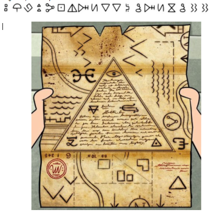

# ShadowCTF Rick and morty on adventure Write Up

## Details:
Points: 50

Jeopardy style CTF

Category: Cryptography

## Write up:

This challenge presented the following image:



A reverse image search of the photo revealed that the map belonged to the show gravity falls. From here I went to a decoder for the gravity falls bill cipher.

After using a decoder I got:

``` 
MORTYLIKESSNAKEJAZZ
```

This ended up not being the correct flag so I tried using all lowercase which was the correct flag.