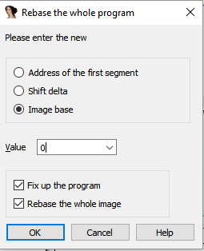
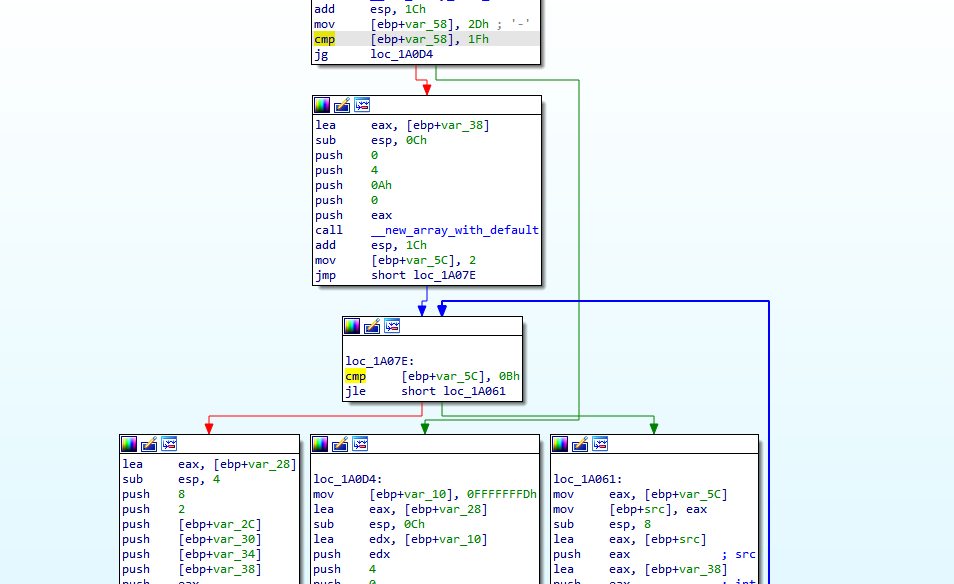

# Offshift hash Write Up

## Details:
Points: 500

Jeopardy style CTF

Category: Reversing

Comment: I received a corrupted program the keys are probably lost within the game can you just find it for me to get the flag?.

Flag format : flag{key1+key2}

## Write up:

Using strings on the file I noticed that this file had been packed with UPX so the first thing I did was unpack the file. After unpacking I ran the file to see what it would output:

```
$ ./keyjoinfile      
Oops wrong path
Oops wrong path
```

I then loaded the file into IDA and looked at the code:

``` c
int __cdecl main(int argc, const char **argv, const char **envp)
{
  vinit(argc, argv);
  main__main();
  return 0;
}
```

``` c
int main__main()
{
  println("Oops wrong path", 15);
  return println("Oops wrong path", 15);
}
```

I then looked at the graphical view of the main function:


The code moves 17h into ebp+var_28 and then compares it to 2Dh. If these values are not equal, which they never are in this case, it never calls main_one. After the main_one call there is another compare, this time with ebp+var_24 to 4Ch. In order to make the code follow the right path I needed to patch the program so the cmp's had the same value.

To do this I first rebased the program to 0. 

```
edit->segments->rebase program
```



Now I have the hex offset to the opcodes I want to change:

```
.text:00019F82 C7 45 D8 17 00 00 00                 mov     [ebp+var_28], 17h
.text:00019F89 C7 45 DC 8C 09 00 00                 mov     [ebp+var_24], 98Ch
```

I opened the program in a hex editor and patched the bytes so that it would move 2Dh and 4Ch into the values. After patching the program I ran it again and got the following response this time:

```
$ ./keyjoinfile

You don't have the first part of key yet
```

I then went back to IDA and checked out the main_one function. The main_one branch also had a jump that would never be reached:



```
.text:0001A037 83 7D A8 1F                          cmp     [ebp+var_58], 1Fh
.text:0001A03B 0F 8F 93 00 00 00                    jg      loc_1A0D4
```

I needed to patch the comparison here so that the new value would always be greater, I decided to compare with 7Fh rather than 1Fh. After patching the program and running it again I got the following output:

```
$ ./keyjoinfile  

[4, 5, 6, 7, 8, 9]
```

The file seemed to output the first part of the key and then exit. I then went back and edited the original patch so that the file wouldn't go into the first branch. Added the patch and running the file output:

```
$ ./keyjoinfile

Oops wrong path
```

I then went to main_two and looked at the code. I noticed that there were two deadends:

```
.text:0001A16E C7 85 18 FF FF FF 5A 00 00 00    mov     [ebp+var_E8], 5Ah ; 'Z'
.text:0001A178 83 BD 18 FF FF FF 2C             cmp     [ebp+var_E8], 2Ch ; ','
```

and 

```
.text:0001A233 C7 85 1C FF FF FF 4D 00 00 00   mov     [ebp+var_E4], 4Dh ; 'M'
.text:0001A23D 83 BD 1C FF FF FF 4B            cmp     [ebp+var_E4], 4Bh ; 'K'
```

After patching these two sections I ran the program again and it output:

```
$ ./keyjoinfile

Oops wrong path
['J', 'K', 'L', 'q', '5', '9', 'U', '1', '3', '3', '7']
```

After adding the keys together like the comment says I got that the flag was:

```
flag{456789+JKLq59U1337}
```