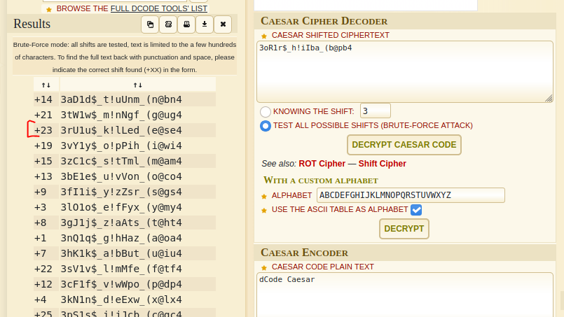

# ShadowCTF Brutus Killer Write Up

## Details:
Points: 50

Jeopardy style CTF

Category: Forensics

Comment: Brutus has planned something to kill ceaser and ceaser has dreamed to be k!lLed but brutus is hiding his mission code. Can you find that code?

## Write up:

Running strings on the image provided me with the following:

``` 
strings img1.jpg

...
H'cC
"G      $
m$F>
6>'k
uBUlYf
J-YA
/$00a
[?\L
        mm[q
flag{3oR1r$_h!iIba_(b@pb4}
```

The flag seemed to be encrypted, using the comment on the challenge I surmised that the flag used a Caesar cipher.

Running the cipher through a brute force decoder I got the follow:

