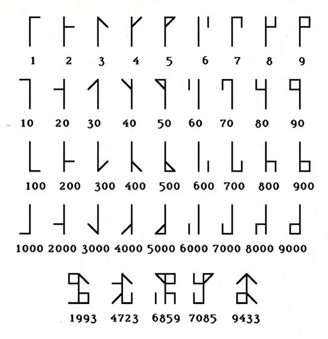

# ShadowCTF Monk Write Up

## Details:
Points: 50

Jeopardy style CTF

Category: Cryptography

## Write up:

I was presented with the following image:

The symbols actually looked fairly familiar, but since I couldn't quite remember where I had seen them befoe I started by googling monk runes. One of the first results in google images was the following:

The way these runes work is that by adding them together you get different numbers. You can see some examples at the bottom of the image.

After decrypting I got the following values:

66 111 119 95 84 48 95 84 104 51 95 71 79 100

These values are all in the range for ascii values so I started with an ascii table and got the following flag:

Bow_T0_Th3_GOd