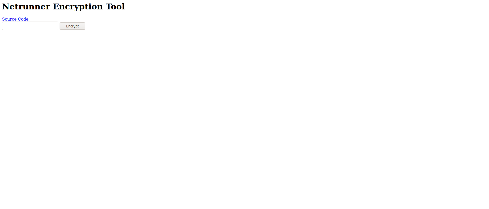

# Tenable Netrunner Encryption Write Up

## Details:
Points: 200

Jeopardy style CTF

Category: Crypto

Comment:


Take a look at the new encryption tool out that netrunner gonk friends are using:

http://167.71.246.232:8080/crypto.php


## Write up:

Looking at the url I saw the following webpage:



Clicking on the source code I saw:


``` php
<html>
<body>
  <h1>Netrunner Encryption Tool</h1>
  <a href="netrun.txt">Source Code</a>
  <form method=post action="crypto.php">
  <input type=text name="text_to_encrypt">
  <input type="submit" name="do_encrypt" value="Encrypt">
  </form>

<?php

function pad_data($data)
{
  $flag = "flag{wouldnt_y0u_lik3_to_know}"; 

  $pad_len = (16 - (strlen($data.$flag) % 16));
  return $data . $flag . str_repeat(chr($pad_len), $pad_len);
}

if(isset($_POST["do_encrypt"]))
{
  $cipher = "aes-128-ecb";
  $iv  = hex2bin('00000000000000000000000000000000');
  $key = hex2bin('74657374696E676B6579313233343536');
  echo "</br><br><h2>Encrypted Data:</h2>";
  $ciphertext = openssl_encrypt(pad_data($_POST['text_to_encrypt']), $cipher, $key, 0, $iv); 

  echo "<br/>";
  echo "<b>$ciphertext</b>";
}
?>
</body>
</html>
```

I noticed that any text you input got encrypted and then the encrypted flag and padding were appended to it afterwards. My teammate and I then made the following script to decrypt one letter at a time by block width. This works because we could set the first block to anything we wanted and thus knew what it was:

OURDATA|FLAG|PADDING


``` python
from Crypto.Cipher import AES
import threading
import requests
import base64

# url to try
url = "http://167.71.246.232:8080/crypto.php"

# all possible characters
chars = 'abcdefghijklmnopqrstuvwxyzABCDEFGHIJKLMNOPQRSTUVWXYZ1234567890-_!@#{} '

# decoded flag
FLAG = ''

# length of a's to send
i_len = 15-len(FLAG)

# Checks if the character properly encodes the data
# expected = expected block
# d = data to send in post
# c = character to test
def func(expected, d, c):
    x = {'text_to_encrypt': d+FLAG+c, 'do_encrypt': 'Encrypt'}
    res = requests.post(url, data=x)
    z = res.text.split('Encrypted Data:</h2><br/><b>')[-1].split('</b>')[0]
    z = base64.b64decode(z).hex()[:32]
    if expected == z:
        print(c)

# data to send
data = 'a'*i_len

# post payload, send our data to be encrypted
payload = {'text_to_encrypt': data, 'do_encrypt': 'Encrypt'}

# post request, webpage with encrypted data
response = requests.post(url, data=payload)

# gets encrypted data
x = response.text.split('Encrypted Data:</h2><br/><b>')[-1].split('</b>')[0]

# gets first 2 blocks
x = base64.b64decode(x).hex()[:32]

threads = []
for i in chars:
    t = threading.Thread(target=func, args=(x, data, i,))
    t.start()
    threads.append(t)
for i in threads:
    i.join()
```

Each time this was run we got one more letter which we then added to the FLAG variable. We kept doing this until we had the entire first block of the flag, however the flag was split out over two blocks so we had to update the script to check the second block:


``` python
FLAG = 'flag{b4d_bl0cks_'
i_len = 15+16-len(FLAG)


def func(expected, d, c):
    x = {'text_to_encrypt': d+FLAG+c, 'do_encrypt': 'Encrypt'}
    res = requests.post(url, data=x)
    z = res.text.split('Encrypted Data:</h2><br/><b>')[-1].split('</b>')[0]
    z = base64.b64decode(z).hex()[32:64]
    if expected == z:
        print(c)


data = 'a'*i_len
payload = {'text_to_encrypt': data, 'do_encrypt': 'Encrypt'}
response = requests.post(url, data=payload)
x = response.text.split('Encrypted Data:</h2><br/><b>')[-1].split('</b>')[0]
x = base64.b64decode(x).hex()[32:64]
threads = []
for i in chars:
    t = threading.Thread(target=func, args=(x, data, i,))
    t.start()
    threads.append(t)
for i in threads:
    i.join()
```

Once fully decrypted we got:

```
flag{b4d_bl0cks_for_g0nks}
```