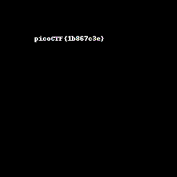

# picoCTF Pixelated Write Up

## Details:
Points: 200

Jeopardy style CTF

Category: Cryptography

Comments: I have these 2 images, can you make a flag out of them? scrambled1.png scrambled2.png

## Write up:

I decided to open these files up using PIL to play around a little. Xor'ing the various pixels together I noticed that most of the xor values ended up being 255,255,255.

I then wrote a python script to xor all the values together but the photo was mostly white with a little but of blue in it. I then decided that everything that was pure white should be turned black:

```python
# import Image
from PIL import Image

# open both photos
i1 = Image.open('scrambled1.png')
i2 = Image.open('scrambled2.png')

# get width and height
width1, height1 = i1.size

# open new image
i3 = Image.new('RGB', (width1, height1))

# load the pixels
pixels = i3.load()

# loop through all pixels
for i in range(width1):
	for j in range(height1):
        # xor the values
		x = i1.getpixel((i,j))[0] ^ i2.getpixel((i,j))[0]
		y = i1.getpixel((i,j))[1] ^ i2.getpixel((i,j))[1]
		z = i1.getpixel((i,j))[2] ^ i2.getpixel((i,j))[2]

        # if all white then convert to black
		if (x,y,z) == (255,255,255):
			(x,y,z) = (0,0,0)

        # put the new pixels in place
		i3.putpixel((i,j), (x,y,z))

# save the image
i3.save("test.png", "PNG")
```

This resulted in the following image:

