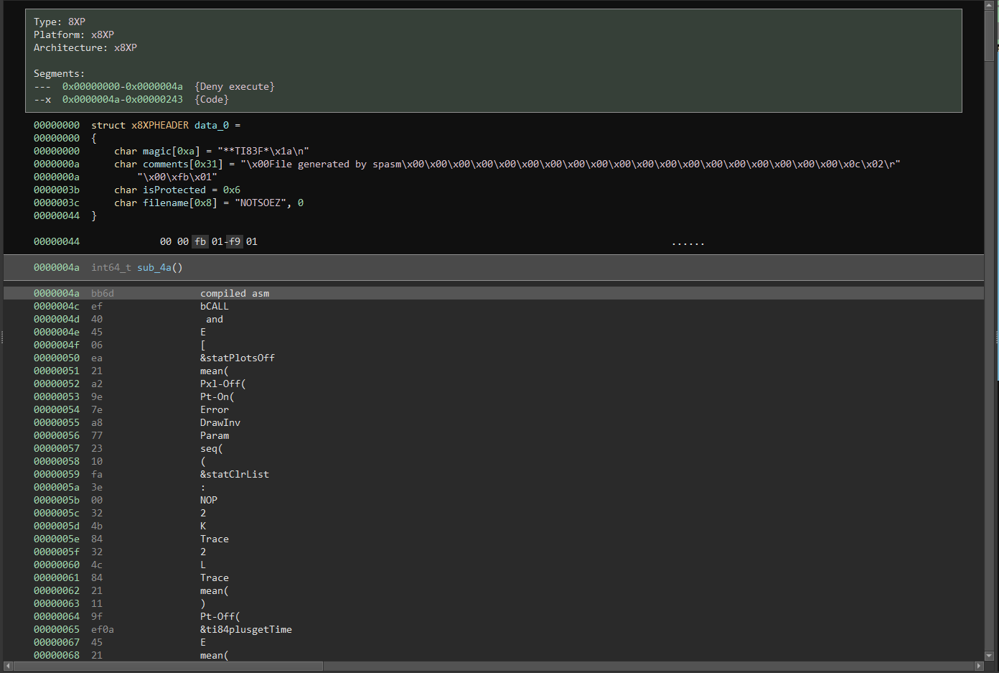

# Buckeye Not So E(Z80) Write Up

## Details:

Jeopardy style CTF

Category: Reverse Engineering

Comments:

Hmmm, that last challenge didn't really make use of the blisteringly fast CPU that TI offers. Maybe we can get lower level?

## Write up:

Running file on the .8xp file I saw that this was a TI-83+ Graphing Calculator assembly program and the previous tool I had used for basic had lots of errors so I used some of the code from there and built a plugin for binja.

I created a types.h with the header:

```c
struct x8XPHEADER {
    char magic[0xa];
    char comments[0x31];
    char isProtected;
    char filename[0x8];
};
```

And then I made the following `__init__`.py:

```py
from binaryninja.architecture import Architecture
from binaryninja.binaryview import *
from binaryninja.function import RegisterInfo, InstructionInfo, InstructionTextToken
from binaryninja.enums import InstructionTextTokenType, BranchType, SegmentFlag, SymbolType
from binaryninja.types import *
from binaryninjaui import UIContext
import dict_source

use_default_loader_settings = True

def loadDict (options = dict_source.index()):
    ki=0 # ki is the key index
    vi=0 # vi is the value index
    (ki, vi) = (0, 1)
    d = {}
    # load optional items first
    for item in options:
        # load each optional group
        try:
            m = [(t, "&%s%s" % (item, s.replace("&", "")), h) for (t, s, h) in getattr(dict_source, item)()]
            # We need to correct the dictionary.
            for li in m:
                d[li[ki]] = li[vi]
        except AttributeError:
            _logger.error("%s does not exist!", item)
    for li in dict_source.base():
        #Get the base values
        d[li[ki]] = li[vi]
    if b"" != "":
        # Convert the string literals from unicode to bytes in Python 3.
        # (index 1 are the textual tokens)
        if ki == 1:
            d = dict((k.encode("utf8"), v) for k, v in d.items())
        if vi == 1:
            d = dict((k, v.encode("utf8")) for k, v in d.items())
    return d

class Disassembler():

    def __init__(self):
        self.dict = loadDict()
        self.max_key_len = max([len(k) for k, v in self.dict.items()])

    def disassemble(self, data, addr):
        readlen = self.max_key_len
        current = data[0:readlen]

        while readlen > 1 and not current in self.dict:
            readlen -= 1
            current = data[0:readlen]
        
        if current in self.dict:
            command = self.dict[current]
        elif current == b'\x00':
            command = "NOP"
        elif current == b'\xef':
            command = "bCALL"
        else:
            command = "Error"

        return (command, len(current))
        

disasm = Disassembler()

class x8XP(Architecture):
    name = 'x8XP'

    def get_instruction_info(self, data, addr):

        (instrTxt, instrLen) = disasm.disassemble(data, addr)
        if instrLen == 0:
            return None
        result = InstructionInfo()

        result.length = instrLen
        return result 

    def get_instruction_text(self, data, addr):
        (instrTxt, instrLen) = disasm.disassemble(data, addr)

        result = []

        
        result.append(InstructionTextToken(InstructionTextTokenType.TextToken, instrTxt))

        return result, instrLen

    def get_instruction_low_level_il(self, data, addr, il):
            return None

# Define our view
class x8XPView(BinaryView):
    name = '8XP'
    long_name = '8XP View'

    # check if this is an MSDOS file
    @classmethod
    def is_valid_for_data(cls,data):
        if data.read(0, 8) == b'**TI83F*':
            return True
        return False

    # intialize the binary view
    def __init__(self, data):
        BinaryView.__init__(self, parent_view = data, file_metadata = data.file)
        self.platform = Architecture['x8XP'].standalone_platform
        self.data = data


    def _define_types(self):
        path = os.path.dirname(os.path.abspath(__file__))
        result = self.platform.parse_types_from_source_file(os.path.join(path, "types.h"), auto_type_source="source")
        for type_name, _type in result.types.items():
            self.define_type(Type.generate_auto_type_id("source", type_name), type_name,_type)


    # initialize our view
    def init(self):
        self._define_types()
        self.define_data_var(0x0,self.types['x8XPHEADER'])
        self.add_auto_segment(0x0, 0x4a, 0x0, 0x4a, SegmentFlag.SegmentDenyExecute)
        self.add_auto_segment(0x4a, len(self.parent_view) - 0x4a - 2, 0x4a, len(self.parent_view) - 0x4a - 2, SegmentFlag.SegmentExecutable|SegmentFlag.SegmentContainsCode)
        self.add_entry_point(0x4a)

        return True
    
    def perform_is_executable(self):
        return True

x8XP.register()
x8XPView.register()
```

I decided to make my own Architecture rather than using Z80 since I wanted to see what the corresponding TI commands would be to see how they would compare to the actual Z80 assembly instructions.  

When I opened the file with my plugin I saw the following:



Sadly it did not look like much would match up, however I was able to see that the command at 0x4a marked the start of the assembly code so I could use a Z80 disassembler to disassemble from 0x4c to the end of the file and started to comment it a bit:

```
.data:0000004c ef                               rst 0x28 		
.data:0000004d 40                               		
.data:0000004e 45                               				// Call to 4540 _ClrLCDFull	- clears screen
	
.data:0000004f 06 ea                            ld b,0xea		// load ea into b
.data:00000051 21 a2 9e                         ld hl,0x9ea2	// load 9ea2 into hl
.data:00000054 7e                               ld a,(hl)	
.data:00000055 a8                               xor b			// xor ea with memory at 9ea2
.data:00000056 77                               ld (hl),a		
.data:00000057 23                               inc hl			// load xor result into address at hl and increment hl
.data:00000058 10 fa                            djnz 0x0054		// decrease b, if not zero perform relative jump (Jump to AE)
.data:0000005a 3e 00                            ld a,0x00		// set a to 0
.data:0000005c 32 4b 84                         ld (0x844b),a	// load 0 into memory address
.data:0000005f 32 4c 84                         ld (0x844c),a	// load 0 into memory address
.data:00000062 21 11 9f                         ld hl,0x9f11	// load new address into hl

.data:00000065 ef                               rst 0x28		
.data:00000066 0a                               	
.data:00000067 45                               				// Call to 450a _PutS - writes what is in hl
			
.data:00000068 21 5a 9f                         ld hl,0x9f5a	
.data:0000006b 0e 26                            ld c,0x26		// Load 0x26 (38) into c, possibly the flag len
.data:0000006d cd 21 9e                         call 0x9e21
.data:00000070 21 5a 9f                         ld hl,0x9f5a	// Start hl at 9f5a
.data:00000073 11 08 85                         ld de,0x8508	// Start de at 8508

.data:00000076 7e                               ld a,(hl)		// Load data at hl into a
.data:00000077 12                               ld (de),a		// Load a into data at address of de
.data:00000078 23                               inc hl			// Increment address pointer
.data:00000079 13                               inc de			// Increment address pointer  
.data:0000007a b7                               or a			// Or a with a
.data:0000007b 20 f9                            jr nz,0x0076	// If zero flag is reset jump to 76 - While or does not equal 0 move characters from hl into de
.data:0000007d 21 08 85                         ld hl,0x8508
.data:00000080 cd 80 9e                         call 0x9e80
.data:00000083 b7                               or a			// Or a with a
.data:00000084 28 17                            jr z,0x009d		// If zero flag is set jump to 9d
.data:00000086 21 08 85                         ld hl,0x8508
.data:00000089 cd a2 9e                         call 0x9ea2
.data:0000008c 21 08 85                         ld hl,0x8508
.data:0000008f cd 97 9e                         call 0x9e97
.data:00000092 21 19 9f                         ld hl,0x9f19
.data:00000095 11 08 85                         ld de,0x8508
.data:00000098 cd ff 9e                         call 0x9eff
.data:0000009b 28 0b                            jr z,0x00a8		// If zero flag is set jump to a8
.data:0000009d 21 3f 9f                         ld hl,0x9f3f

.data:000000a0 ef                               rst 0x28
.data:000000a1 0a                               
.data:000000a2 45                               				// Call to 450a _PutS - writes what is in hl

.data:000000a3 ef                               rst 0x28
.data:000000a4 2e 45                            				// Call to 452e _newline - writes new line
		
.data:000000a6 18 1e                            jr 0x00c6		// Jump to c6
.data:000000a8 21 46 9f                         ld hl,0x9f46

.data:000000ab ef                               rst 0x28
.data:000000ac 0a                               
.data:000000ad 45                               				// Call to 450a _PutS - writes what is in hl

.data:000000ae ef                               rst 0x28
.data:000000af 2e 45                            				// Call to 452e _newline - writes new line

.data:000000b1 21 4f 9f                         ld hl,0x9f4f	

.data:000000b4 ef                               rst 0x28
.data:000000b5 0a                               
.data:000000b6 45                               				// Call to 450a _PutS - writes what is in hl

.data:000000b7 21 5a 9f                         ld hl,0x9f5a

.data:000000ba ef                               rst 0x28
.data:000000bb 0a                               
.data:000000bc 45                               				// Call to 450a _PutS - writes what is in hl

.data:000000bd 21 58 9f                         ld hl,0x9f58

.data:000000c0 ef                               rst 0x28
.data:000000c1 0a                               	
.data:000000c2 45                               				// Call to 450a _PutS - writes what is in hl

.data:000000c3 ef                               rst 0x28
.data:000000c4 2e 45                            				// Call to 452e _newline - writes new line

.data:000000c6 21 80 9f                         ld hl,0x9f80

.data:000000c9 ef                               rst 0x28
.data:000000ca 0a                               
.data:000000cb 45                               				// Call to 450a _PutS - writes what is in hl

.data:000000cc 21 5a 9f                         ld hl,0x9f5a
.data:000000cf 0e 01                            ld c,0x01
.data:000000d1 cd 21 9e                         call 0x9e21

.data:000000d4 ef                               rst 0x28
.data:000000d5 40                               
.data:000000d6 45                               				// Call to 4540 _ClrLCDFull - Clear screen

.data:000000d7 c9                               ret

// Get key function
.data:000000d8 fd cb 0d 8e                      res 1,(iy+13)
.data:000000dc af                               xor a
.data:000000dd 47                               ld b,a
.data:000000de 0d                               dec c

.data:000000df eb                               ex de,hl		// Preserve hl since GetCSC destroys hl

.data:000000e0 ef                               rst 0x28
.data:000000e1 18 40                            				// Call to 4018 _GetCSC	- Gets key press but does not wait for user to press key (key codes http://z80-heaven.wikidot.com/getcsc-codes)

.data:000000e3 eb                               ex de,hl		// Save pressed key value
.data:000000e4 b7                               or a
.data:000000e5 28 f8                            jr z,0x00df		// If no key pressed go back to df and find again
.data:000000e7 fe 09                            cp 0x09			// Check if some character was pressed
.data:000000e9 20 06                            jr nz,0x00f1	// If character was not pressed go to f1 address
.data:000000eb 36 00                            ld (hl),0x00	// If it was the end brace then set the memory at hl to 0

.data:000000ed ef                               rst 0x28
.data:000000ee 2e 45                            				// Call to 452e _newline - writes new line

.data:000000f0 c9                               ret				// return function


// Start of not of flag brace
.data:000000f1 57                               ld d,a
.data:000000f2 78                               ld a,b
.data:000000f3 b9                               cp c			// subtract c from a without subtraction updating a
.data:000000f4 28 e9                            jr z,0x00df		// jump to df (get character) if zero flag is set (a and c were the same value)
.data:000000f6 7a                               ld a,d
.data:000000f7 d6 0a                            sub 0x0a		// subtract 0xa from a
.data:000000f9 38 e4                            jr c,0x00df		// jump to df (get character) if carry flag is set (result did not fit in register)
.data:000000fb fe 26                            cp 0x26			// subtract 0x26 from a without subtraction updating a
.data:000000fd 30 e0                            jr nc,0x00df	// jump to df (get character) if carry flag is reset
.data:000000ff e5                               push hl			// preserve hl
.data:00000100 26 00                            ld h,0x00
.data:00000102 6f                               ld l,a			// Turn hl into 00[value of a]
.data:00000103 11 5a 9e                         ld de,0x9e5a	// Get base pointer to data most likely
.data:00000106 19                               add hl,de		// turn hl into pointer for char we want
.data:00000107 7e                               ld a,(hl)		// load the char from memory into a
.data:00000108 e1                               pop hl			// restore hl

.data:00000109 ef                               rst 0x28
.data:0000010a 04                               inc b
.data:0000010b 45                               				// Call to 4504 _PutC - writes a's ascii value to the screen

.data:0000010c 77                               ld (hl),a		// load char we just wrote into the variable at the hl address
.data:0000010d 23                               inc hl			// increment the pointer NOT THE DATA AT THE LOCATION
.data:0000010e 04                               inc b			// increment b
.data:0000010f 18 ce                            jr 0x00df		// jump to get character label
...
```

Now that I had a general of how the program worked I decided to switch to doing some dynamic analysis. After a bit of research I downloaded an emulator called Wabbitemu, I also found out that to run an assembly program on the calculator I would need to upload the program (file->open .8xp file) and then create another program that called the assembly program using Asm( which was in the catalog.

Once I was able to run the program I was able to use the debugger that Wabbitemu has to step through what happens in the program after we press enter. Based on the static analysis I had done I set a few breakpoints on the putS functions since I knew those would be around actions such as guess, correct, wrong etc.

After a bit of analysis I saw that when we press enter we start at this point in the code:

```
.data:00000070 21 5a 9f                         ld hl,0x9f5a	// Start hl at 9f5a
.data:00000073 11 08 85                         ld de,0x8508	// Start de at 8508

.data:00000076 7e                               ld a,(hl)		// Load data at hl into a
.data:00000077 12                               ld (de),a		// Load a into data at address of de
.data:00000078 23                               inc hl			// Increment address pointer
.data:00000079 13                               inc de			// Increment address pointer  
.data:0000007a b7                               or a			// Or a with a
.data:0000007b 20 f9                            jr nz,0x0076	// If zero flag is reset jump to 76 - While or does not equal 0 move characters from hl into de
.data:0000007d 21 08 85                         ld hl,0x8508
.data:00000080 cd 80 9e                         call 0x9e80
.data:00000083 b7                               or a			// Or a with a
.data:00000084 28 17                            jr z,0x009d		// If zero flag is set jump to 9d
.data:00000086 21 08 85                         ld hl,0x8508
.data:00000089 cd a2 9e                         call 0x9ea2
.data:0000008c 21 08 85                         ld hl,0x8508
.data:0000008f cd 97 9e                         call 0x9e97
.data:00000092 21 19 9f                         ld hl,0x9f19
.data:00000095 11 08 85                         ld de,0x8508
.data:00000098 cd ff 9e                         call 0x9eff
.data:0000009b 28 0b                            jr z,0x00a8		// If zero flag is set jump to a8
.data:0000009d 21 3f 9f                         ld hl,0x9f3f

.data:000000a0 ef                               rst 0x28
.data:000000a1 0a                               
.data:000000a2 45                               				// Call to 450a _PutS - writes what is in hl
```

At this point I had also learned that our input was stored in memory at 0x8508 so whenever we saw that it would mean that we were at the input. As you can see we call 4 functions and then check if the zero flag is set, so I decided to step through each of these functions to see what they do:

The first function (call 0x9380) was:

```
9E80:7e:		  ld a,(hl)		
9E81:b7:		  or a		
9E82:280d:		  jr z,$9E91		
9E84:d641:		  sub $41		
9E86:380d:		  jr c,$9E95	
9E88:fe19:		  cp $19		
9E8A:3009:		  jr nc,$9E95	
9E8C:3c:		  inc a		
9E8D:77:		  ld (hl),a		
9E8E:23:		  inc hl	
9E8F:18ef:		  jr $9E80		
9E91:3e01:		  ld a,$01		
9E93:1801:		  jr $9E96		
9E95:af:		  xor a		
9E96:c9:		  ret		
```

For this function hl was the pointer to our input so on the first line we load the first character into a. We then or a with itself and check for the zero flag being checked which means that we are simply checking if a is 00 (end of string). 

We then subtract 0x41 and then check whether we are able to subtract 0x19 from it (cp subtracts from the accumulator without actually changing the accumulator). What this does is it checks that all input characters are between A and Z.

We then increase a and store it back at its original location. After that we increment the pointer to the next character and jump back to the start of the function.

When we reach a being 00 we then jump to line 0x9e91, load 0x01 into a and then return from this function.

We then go into the second function (call 0x9ea2):

```
9EA2:0e01:		  ld c,$01
9EA4:7e:		  ld a,(hl)
9EA5:b7:		  or a
9EA6:2824:		  jr z,$9ECC		
9EA8:3d:		  dec a
9EA9:e5:		  push hl	
9EAA:11cd9e:	  ld de,$9ECD	
9EAD:2600:		  ld h,$00
9EAF:6f:		  ld l,a
9EB0:19:		  add hl,de	
9EB1:7e:		  ld a,(hl)
9EB2:41:		  ld b,c
9EB3:c60b:		  add $0B	
9EB5:fe19:		  cp $19		
9EB7:3802:		  jr c,$9EBB		
9EB9:d619:		  sub $19
9EBB:10f6:		  djnz $9EB3		
9EBD:11e69e:	  ld de,$9EE6
9EC0:2600:		  ld h,$00
9EC2:6f:		  ld l,a
9EC3:19:		  add hl,de	
9EC4:7e:		  ld a,(hl)
9EC5:3c:		  inc a
9EC6:e1:		  pop hl	
9EC7:77:		  ld (hl),a
9EC8:23:		  inc hl
9EC9:0c:		  inc c
9ECA:18d8:		  jr $9EA4	
9ECC:c9:		  ret	
```

In this function we set c to 0x01, load the first character into a, and then check if it is 0x00. 

If a is not 0 then we decrease a by 1, push hl to save the value for later, and then load a memory address into de. We the zero out h and set l to be a, effectively turning hl into an offset (e.g. is a is 01 hl turns into 0001). When then add hl and de together to give us the offset we need into the memory location. We then load the byte at that location in memory into a. At this point I took did a memory dump and checked out that memory location (All values at 1 rather than 9):

```
01 1EC0: 26 00 6F 19 7E 3C E1 77 23 0C 18 D8 C9 03 08 14 02 18 17 06 0C 13 00 16 05 0F 11 0B 10 09 0D 12 
```

So from our example value we would be loading the memory at 0x9ece into a turning a into 0x08.

We then load the value of c into b, this is done for the djnz command since that checks b to do jumps.

After loading c into b we enter a little loop. In this loop we add 0x0B to a, check if we can subtract 0x19 from a and if we can then we subtract 0x19 (this keeps our offset short since we only want to look so far into memory in the next part). Then we hit djnz which subtracts b and if it is not 0 we jump to the locaion (start of loop we have here). On the first pass the jump will not happen since c was set to 1 but later on it does loop through this several times.

After the loop we load a new memory address into memory and do the offset with a like we did before. We then load the character at that offset into a. At this point with our example a would have been 0x13 turning hl into 0x0013 and then into 0x9ef9 which would the load 0x08 into a when we look at the memory:

```
01 1EE0: 01 04 0A 0E 07 15 09 13 03 00 14 0B 06 17 01 10 15 0E 07 11 16 0C 0F 0D 12 08 02 18 0A 05 04 E5 
01 1F00: D5 C5 1A ED A1 20 06 B7 28 03 13 18 F5 C1 D1 E1 C9 47 55 45 53 53 3A 20 00 57 46 52 53 42 51 41 
01 1F20: 51 56 57 46 53 56 4C 58 4A 4F 4A 48 43 51 4F 42 4B 52 56 4A 4C 43 50 55 47 4C 4A 4B 4D 4A 00 57 
01 1F40: 52 4F 4E 47 21 00 43 4F 52 52 45 43 54 21 00 42 55 43 4B 45 59 45 7B 00 7D 00 42 55 43 4B 00 46 
01 1F60: 47 48 49 4A 4B 4C 4D 4E 4F 50 51 52 53 54 55 56 57 58 59 41 41 42 42 43 43 44 44 45 45 46 46 00 
01 1F80: 50 52 45 53 53 20 45 4E 54 45 52 00 0B 00 00 00 00 00 00 00 00 00 00 00 00 00 00 80 00 00 00 00 
```

We then increment a, restore hl to the input character pointer and store a back at its position. After storing a we increment the hl pointer, increase the value in c and then restart the loop (value of c is not 2 meaning that we would loop through the djnz loop this time). This function is again repeated until we hit the end of the input.

We then proceed to the third function (call 0x9e97):

```
9E97:7e:		  ld a,(hl)		
9E98:b7:		  or a		
9E99:2806:		  jr z,$9EA1		
9E9B:c640:		  add $40	
9E9D:77:		  ld (hl),a	
9E9E:23:		  inc hl		
9E9F:18f6:		  jr $9E97		
9EA1:c9:		  ret	
```

This is luckily a nice simple function. As you could probably guess at this point, we start the function by loading a with the character and checking if it is the end of the input. We then add 0x40 to a, store it, and increment the pointer. So all this function does is go through and add 0x40 to all values in the input.

We then proceed to our final function which is used to check the values (call 0x9eff):

```
9EFF:e5:		  push hl		
9F00:d5:		  push de		
9F01:c5:		  push bc		
9F02:1a:		  ld a,(de)	
9F03:eda1:		  cpi		
9F05:2006:		  jr nz,$9F0D		
9F07:b7:		  or a	
9F08:2803:		  jr z,$9F0D		
9F0A:13:		  inc de		
9F0B:18f5:		  jr $9F02		
9F0D:c1:		  pop bc		
9F0E:d1:		  pop de		
9F0F:e1:		  pop hl		
9F10:c9:		  ret		
```

At the start and end of this function we simply push and pop some values so that we can restore them after the function is called. 

BC contains the total length of our input plus 1 (string terminator). This is because in the second function we were using djnz which lowers b until it is 00 while c was being incremented for each character we had starting at 01.

Before this function is called we move the address for our input into de rather than hl so the ld, a, (de) loads our first character into a. 

We then use the cpi command which does a few things. It checks if the value stored at hl is the same as what is in the accumulator (a), it increases the hl pointer, and decreases the value of bc. This command coupled with the jump after it means that we always want the value in memory to be the same as our input string. 

If we passed that check we then or a to check if we are at the end of the string, increment the input pointer and keep looping.

So then I looked a the memory from the address we had stored in hl and saw:

```
01 1F00: D5 C5 1A ED A1 20 06 B7 28 03 13 18 F5 C1 D1 E1 C9 47 55 45 53 53 3A 20 00 57 46 52 53 42 51 41 
01 1F20: 51 56 57 46 53 56 4C 58 4A 4F 4A 48 43 51 4F 42 4B 52 56 4A 4C 43 50 55 47 4C 4A 4B 4D 4A 00 57 
```

0x9F19 starts at 57 and then we have 38 bytes till we reach 00 which I had suspected was the length anyways.

After getting all this information I went and wrote a python script to solve the challenge:

```py
# values used for the final check
finCheck = [0x57, 0x46, 0x52, 0x53, 0x42, 0x51, 0x41, 0x51, 0x56, 0x57, 0x46, 0x53, 0x56, 0x4C, 0x58, 0x4A, 0x4F, 0x4A, 0x48, 0x43, 0x51, 0x4F, 0x42, 0x4B, 0x52, 0x56, 0x4A, 0x4C, 0x43, 0x50, 0x55, 0x47, 0x4C, 0x4A, 0x4B, 0x4D, 0x4A, 0x00]

# first memory chunk
firstMem = [0x03, 0x08, 0x14, 0x02, 0x18, 0x17, 0x06, 0x0C, 0x13, 0x00, 0x16, 0x05, 0x0F, 0x11, 0x0B, 0x10, 0x09, 0x0D, 0x12, 0x01, 0x04, 0x0A, 0x0E, 0x07, 0x15, 0x09, 0x13, 0x03, 0x00, 0x14, 0x0B, 0x06, 0x17, 0x01, 0x10, 0x15, 0x0E, 0x07, 0x11, 0x16, 0x0C, 0x0F, 0x0D, 0x12, 0x08, 0x02, 0x18, 0x0A, 0x05, 0x04, 0xE5, 0xD5, 0xC5, 0x1A, 0xED, 0xA1, 0x20, 0x06, 0xB7, 0x28, 0x03, 0x13, 0x18, 0xF5, 0xC1, 0xD1, 0xE1, 0xC9, 0x47, 0x55, 0x45, 0x53, 0x53, 0x3A, 0x20, 0x00, 0x57, 0x46, 0x52, 0x53, 0x42, 0x51, 0x41, 0x51, 0x56, 0x57, 0x46, 0x53, 0x56, 0x4C, 0x58, 0x4A, 0x4F, 0x4A, 0x48, 0x43, 0x51, 0x4F, 0x42, 0x4B, 0x52, 0x56, 0x4A, 0x4C, 0x43, 0x50, 0x55, 0x47, 0x4C, 0x4A, 0x4B, 0x4D, 0x4A, 0x00, 0x57, 0x52, 0x4F, 0x4E, 0x47, 0x21, 0x00, 0x43, 0x4F, 0x52, 0x52, 0x45, 0x43, 0x54, 0x21, 0x00, 0x42, 0x55, 0x43, 0x4B, 0x45, 0x59, 0x45, 0x7B, 0x00, 0x7D, 0x00, 0x42, 0x55, 0x43, 0x4B, 0x00, 0x46, 0x47, 0x48, 0x49, 0x4A, 0x4B, 0x4C, 0x4D, 0x4E, 0x4F, 0x50, 0x51, 0x52, 0x53, 0x54, 0x55, 0x56, 0x57, 0x58, 0x59, 0x41, 0x41, 0x42, 0x42, 0x43, 0x43, 0x44, 0x44, 0x45, 0x45, 0x46, 0x46, 0x00, 0x50, 0x52, 0x45, 0x53, 0x53, 0x20, 0x45, 0x4E, 0x54, 0x45, 0x52]

# second memory chunk
secondMem = [0x09, 0x13, 0x03, 0x00, 0x14, 0x0B, 0x06, 0x17, 0x01, 0x10, 0x15, 0x0E, 0x07, 0x11, 0x16, 0x0C, 0x0F, 0x0D, 0x12, 0x08, 0x02, 0x18, 0x0A, 0x05, 0x04, 0xE5, 0xD5, 0xC5, 0x1A, 0xED, 0xA1, 0x20, 0x06, 0xB7, 0x28, 0x03, 0x13, 0x18, 0xF5, 0xC1, 0xD1, 0xE1, 0xC9, 0x47, 0x55, 0x45, 0x53, 0x53, 0x3A, 0x20, 0x00, 0x57, 0x46, 0x52, 0x53, 0x42, 0x51, 0x41, 0x51, 0x56, 0x57, 0x46, 0x53, 0x56, 0x4C, 0x58, 0x4A, 0x4F, 0x4A, 0x48, 0x43, 0x51, 0x4F, 0x42, 0x4B, 0x52, 0x56, 0x4A, 0x4C, 0x43, 0x50, 0x55, 0x47, 0x4C, 0x4A, 0x4B, 0x4D, 0x4A, 0x00, 0x57, 0x52, 0x4F, 0x4E, 0x47, 0x21, 0x00, 0x43, 0x4F, 0x52, 0x52, 0x45, 0x43, 0x54, 0x21, 0x00, 0x42, 0x55, 0x43, 0x4B, 0x45, 0x59, 0x45, 0x7B, 0x00, 0x7D, 0x00, 0x42, 0x55, 0x43, 0x4B, 0x00, 0x46, 0x47, 0x48, 0x49, 0x4A, 0x4B, 0x4C, 0x4D, 0x4E, 0x4F, 0x50, 0x51, 0x52, 0x53, 0x54, 0x55, 0x56, 0x57, 0x58, 0x59, 0x41, 0x41, 0x42, 0x42, 0x43, 0x43, 0x44, 0x44, 0x45, 0x45, 0x46, 0x46, 0x00, 0x50, 0x52, 0x45, 0x53, 0x53, 0x20, 0x45, 0x4E, 0x54, 0x45, 0x52, 0x00, 0x0B, 0x00, 0x00, 0x00, 0x00, 0x00, 0x00, 0x00, 0x00, 0x00, 0x00, 0x00, 0x00, 0x00, 0x00, 0x80, 0x00, 0x00, 0x00, 0x00, 0x00, 0x00, 0x00, 0x00]

# possible characters
posChars = "ABCDEFGHIJKLMNOPQRSTUVWXYZ"

# flag array
flag = [0] * 38

# loop through the length of the flag
for i in range(len(flag) - 1):
    # test all possible characters
    for j in posChars:
        # store the character
        o = j

        # get value of b for djnz loop
        b = i + 1

        # do operations on input
        j = ord(j) - 0x41
        j = firstMem[j]

        # djnz loop
        while b > 0:
            j += 0xb
            if j - 0x19 >= 0:
                j -= 0x19
            b -= 1

        # second memory access
        j = secondMem[j] + 1 + 0x40

        # if it matches the final check add it to the flag and break the possible char loop
        if j == finCheck[i]:
            flag[i] = o
            break

# print the flag
print("".join([str(i) for i in flag]))
```

And when run I got:

```
ATLEASTYOUDONTNEEDAJAILBREAKTORUNTHIS0
```

The flag was:

```
BUCKEYE{ATLEASTYOUDONTNEEDAJAILBREAKTORUNTHIS}
```
