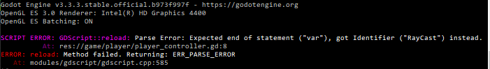

# Tasteless Tasteless Shores Write Up

## Details:

Jeopardy style CTF

Category: Reverse Engineering

Comments:

```
Tasteless Shores
The tasteless MMO

Registration
Register here: http://ts.tasteless.eu:13380/registration

Team token is here: https://ctf.tasteless.eu/user (you need team:token not just the token)

Installation
Linux
Download: https://s3.eu-central-1.amazonaws.com/tstlss.tasteless.eu/tasteless-shores.x86_64 and https://s3.eu-central-1.amazonaws.com/tstlss.tasteless.eu/tasteless-shores.pck

Run ./tasteless-shores.x86_64 in the folder where the tasteless-shores.pck exists.

Windows
Download: https://s3.eu-central-1.amazonaws.com/tstlss.tasteless.eu/tasteless-shores.exe and https://s3.eu-central-1.amazonaws.com/tstlss.tasteless.eu/tasteless-shores.pck

Run tasteless-shores.exe in the folder where the tasteless-shores.pck exists.

Mac OS
Download: https://s3.eu-central-1.amazonaws.com/tstlss.tasteless.eu/tasteless-shores.dmg

Move Tasteless Shores.app to a local folder and clean the quarantine xattr -r -d com.apple.quarantine Tasteless Shores.app

Known Issues
PVP is broken, sorry for that.
Kali VM is not working for the game, appearently
VMWare mouse (thx to idkkkkkkkkkkkkk!): https://stackoverflow.com/questions/45390414/3d-acceleration-vmware-drag-mouse-issues
Under general mouse and keyboard settings set Gaming to "Always optimize mouse for games" . So VMware options -> keyboard + mouse settings, edit the profile, then click on the General tab.

Controls
Mouse to look around

W, A, S, D to move

E to interact

TAB to open inventory

Left mouse click to attack/use item

Right mouse for secondary action (if available)

ENTER to write into chat

Local Setup
Download the master-server:

Linux: https://s3.eu-central-1.amazonaws.com/tstlss.tasteless.eu/server

Windows: https://s3.eu-central-1.amazonaws.com/tstlss.tasteless.eu/server.exe

Mac OS: https://s3.eu-central-1.amazonaws.com/tstlss.tasteless.eu/server.osx

Run local setup:
Masterserver: ./server

Gameserver: ./tasteless-shores.x86_64 server

Game: ./tasteless-shores.x86_64 local

Checksums
MD5 (tasteless-shores.dmg) = 20471dd54b5576660c7c17103fcb7b84
MD5 (tasteless-shores.exe) = 68cc9fb0be256548e1bcfbd986751829
MD5 (tasteless-shores.pck) = 699fa1810daa1aa577589ee9326642b8
MD5 (tasteless-shores.x86_64) = 9fd25146e339cba3c91a414e9865d19e
MD5 (server) = ac2ef6a92052ebe1e25a26785103f495
MD5 (server.exe) = fece04b8dfd3fe316f55b69f63a18be9
MD5 (server.osx) = 43cde1b4d1bc6124793f8b036d06dcf8
Transparency: we updated the server binary due to a stability bug. Old one is available at https://s3.eu-central-1.amazonaws.com/tstlss.tasteless.eu/server_old. This does not affect the game at all. MD5 (server_old) = 20c3924fe9b6be1c662f33805481e781
```


## Write up:

### Setting up the decompiler and repacker

For this challenge I saw that the game was compiled with godot engine, after some quick googling I came across the following tool https://github.com/bruvzg/gdsdecomp/releases and downloaded the most recent release.

I then used the tool to unpack the pck file into a folder using PCK->Explore PCK Archive, during the unpacking process I saw that the pck was version 3.3.3. In this folder I saw lots of .gdc files, and when I ran file on them I saw that they were version 3.2.

I then used the tool to decompile player_controller.gd. Using the tool I did GDScript->Decompile GDC/GDE Script files. I then selected the file, selected bytecode version 3.2 and the destination folder was the same as the source folder.

At this point I had a player_controller.gd, player_controller.gdc, and player_controller.gdc.remap. I deleted the .gdc and .gdc.remap files for player_controller and then repacked the pck using PCK->Create PCK Archive. I made sure to select godot engine version 3.3.3.

At this point when I tried running the program it kept having errors so I decided to run it using the command prompt so I could keep the errors after closing:



The original was:

```
onready  var placeRayCast = $PlaceRayCastas RayCast
```

I was able to see that there was simply an error with not having a space before as. 

```
onready  var placeRayCast = $PlaceRayCast as RayCast
```

After fixing all syntax errors I was able to change any file in the game and pack it with this setup. The tool seems to have a massive memory leak though so packing slowed down every time it was done and the tool needed to be restarted from time to time.

### Skull Island

One of the first things I did in the process was to edit the player controller so that I could fly around and to get rid of gravity, so I changed the _physics_process function in player_controller.gd:

```
func _physics_process(delta):
	vel.x = 0
	vel.z = 0
	
	var input = Vector3()


	if player.health > 0 and not paused and Input.get_mouse_mode() == Input.MOUSE_MODE_CAPTURED:
		
		if Input.is_action_pressed("ui_up"):
			input.z -= 5
		if Input.is_action_pressed("ui_down"):
			player.transform.origin.y -= 1
		if Input.is_action_pressed("ui_left"):
			input.x -= 5
		if Input.is_action_pressed("ui_right"):
			input.x += 5
		
		if Input.is_action_pressed("jump"):
			player.transform.origin.y += 1
	
	
	var dir = (player.transform.basis.z * input.z + player.transform.basis.x * input.x)
	
	
	vel.x = dir.x * currentSpeed * delta * 100
	vel.z = dir.z * currentSpeed * delta * 100
	
	vel = player.move_and_slide(vel, Vector3.UP, true)
	if vel.y > 0:
		vel.y = 0
```

I then flew around the map for a bit and saw a chest in the eye of the skull:

`tstlss{do_you_S33_me_now?}`

### Boat

The next challenge was the boat challenge. After having reversed a bit I found the following function in server2.gd:

```
func _handleFish(pid):
	if not has_node("player_" + str(pid)):
		prints("error, unknown player fish", pid)
		return 
	var node = get_node("player_" + str(pid))
	spawn_chest(node, "FLAG_BOAT", flags["FLAG_BOAT"].global_transform.origin)
```

This function was called when the server got a message from the client to fish:

```
MsgServerFish:
	var pid = socket.get_u64()
	call_deferred("_handleFish", pid)
```

In the client2.gd I found the following function:

```
func start_fish(target):
	socket.put_u8(MsgClientFish)
```

However after some testing I saw that this was not called when you cast the fishing rod so I decided to add it to the function call for conch distance since I knew I could reliably activate that:

```
func _conch(pid, distance):	
	socket.put_u8(MsgClientFish)
	Conch.conch(distance)
```

After pressing the conch the chest on the rock by the boat got a marker and I was able to get the flag:

```
tstlss{im_on_a_boat_everybody_look_at_me!}
```

### Conch

For the conch challenge I first modified the conch.gd file so that rather than getting an arbitrary response for the distance I was able to get the exact distance printed out in the console:

```
static func conch(distance):
    prints("conch", distance)
```

I then added some prints to the conch function in the client2.gd which told me my exact location when pressed:

```
func _conch(pid, distance):	
	prints("X: ", player.global_transform.origin.x)
	prints("Y: ", player.global_transform.origin.y)
	prints("Z: ", player.global_transform.origin.z)
	Conch.conch(distance)
```

From here I now had my coordinates and the distance to the point meaning I could do some sort of triangulation. However I would need to get to the exact coordinate so I needed some sort of teleportation function. As I would have to input some numbers I decided to build the teleport directly into the chat.

I then modified the chat function in client2 with the following:

```
func chat(whisper, msg):
	player.transform.origin.x = msg.split(",")[0].to_float()
	player.transform.origin.y = msg.split(",")[1].to_float()
	player.transform.origin.z = msg.split(",")[2].to_float()
	socket.put_u8(MsgClientChat)
	socket.put_u64(whisper)
	socket.put_u8(msg.length())
	socket.put_data(msg.to_ascii())
```

I then also googled some algorithms for doing triangulation and came across some python, after getting 3 points and their distances my python code was:

```py
import numpy                                             
from numpy import sqrt, dot, cross                       
from numpy.linalg import norm                            

# Find the intersection of three spheres                 
# P1,P2,P3 are the centers, r1,r2,r3 are the radii       
# Implementaton based on Wikipedia Trilateration article.                              
def trilaterate(P1,P2,P3,r1,r2,r3):                      
    temp1 = P2-P1                                        
    e_x = temp1/norm(temp1)                              
    temp2 = P3-P1                                        
    i = dot(e_x,temp2)                                   
    temp3 = temp2 - i*e_x                                
    e_y = temp3/norm(temp3)                              
    e_z = cross(e_x,e_y)                                 
    d = norm(P2-P1)                                      
    j = dot(e_y,temp2)                                   
    x = (r1*r1 - r2*r2 + d*d) / (2*d)                    
    y = (r1*r1 - r3*r3 -2*i*x + i*i + j*j) / (2*j)       
    temp4 = r1*r1 - x*x - y*y                            
    if temp4<0:                                          
        raise Exception("The three spheres do not intersect!");
    z = sqrt(temp4)                                      
    p_12_a = P1 + x*e_x + y*e_y + z*e_z                  
    p_12_b = P1 + x*e_x + y*e_y - z*e_z                  
    return p_12_a,p_12_b  
    
    
P1 = numpy.array([-200, 50, 150])
P2 = numpy.array([400, -200, -150])
P3 = numpy.array([-200, 0, -150])
r1 = 305.375458
r2 = 425.991302
r3 = 247.64267
print(trilaterate(P1,P2,P3,r1,r2,r3))
```

This output:

```
(array([ 15.97898019, -51.70881598, -40.42732791]), array([ 14.79533215, -55.2597601 , -39.83550389]))
```

I then used my chat teleport to teleport to the first value and used the conch and the chest appeared, when interacted with I got the flag:

```
tstlss{follow_th3_wh1t3_r4bbit}
```

### Thrybrush

This was by far the most annoying challenge, mostly due to having to copy and paste lots of lines.

In the guybrush gd file I saw a few important things:

player id was 31337:
```
func _ready():
	Server.enemies["player_31337"] = self
```

We needed to get the correct input "distance" amount of times and we would be returning a value based on a key:
```
func chat(from, msg):
	
	if not (from.remote_id in players):
		return 
	
	var bw = players[from.remote_id]
	var next_try = bw.dig()
	var insult = insults.keys()[next_try]
	if msg == insults[insult]:
		bw.distance -= 1
	else :
		bw.distance += 1

	if bw.distance <= 0:
		Server.spawn_chest(from, "FLAG_BIGWHOOP", Server.flags["FLAG_BIGWHOOP"].global_transform.origin)
		Server.chat(remote_id, from.remote_id, "you are faster than your shadow it seems!")
	else :
		Server.chat(remote_id, from.remote_id, insult)
```

And the logic behind the dig and distance:
```
class BigWhoop:
	var pos = Vector3.ZERO
	var rotation = 0as int
	var distance = 10as int

	func _init():
		pos.x = randi() % 255
		pos.y = randi() % 255
		pos.z = randi() % 255

	func dig():
		var hint = (int(pos.x) ^ ((int(pos.x) << 4)) & 255) & 255
		pos.x = pos.y
		pos.y = pos.z
		pos.z = rotation
		rotation = int(pos.z) ^ hint ^ (int(pos.z) >> 1) ^ ((int(hint) << 1) & 255)
		return rotation % 64

func _on_Area_body_entered(body:Node):
	if Server.socket != null:
		players[body.remote_id] = BigWhoop.new()
```

In client2 gd file I then saw that whisper is always set to 0 so I hardcoded it to whisper to 31337:

```
func chat(whisper, msg):
	socket.put_u8(MsgClientChat)
	socket.put_u64(31337)
	socket.put_u8(msg.length())
	socket.put_data(msg.to_ascii())
```

I decided to write a z3py script that based on the insults the NPC messaged me I would be able to generate the possible seed values for x, y, and z. This would produce false values at first but sometimes I still got the right insult so at least I wasn't wasting guesses:

```py
# import z3
from z3 import *

# insults
insults = {
"You fight like a dairy Farmer!":"How appropriate. You fight like a cow!", 
"This is the END for you, you gutter crawling cur!":"And I've got a little TIP for you, get the POINT?", 
"I've spoken with apes more polite than you!":"I'm glad to hear you attended your family reunion!", 
"Soon you'll be wearing my sword like a shish kebab!":"First you'd better stop waving it like a feather duster.", 
"People fall at my feet when they see me coming!":"Even BEFORE they smell your breath?", 
"I'm not going to take your insolence sitting down!":"Your hemorrhoids are flaring up again eh?", 
"I once owned a dog that was smarter than you.":"He must have taught you everything you know.", 
"Nobody's ever drawn blood from me and nobody ever will.":"You run THAT fast?", 
"Have you stopped wearing diapers yet?":"Why? Did you want to borrow one?", 
"There are no words for how disgusting you are.":"Yes there are. You just never learned them.", 
"You make me want to puke.":"You make me think somebody already did.", 
"My handkerchief will wipe up your blood!":"So you got that job as janitor, after all.", 
"I got this scar on my face during a mighty struggle!":"I hope now you've learned to stop picking your nose.", 
"I've heard you are a contemptible sneak.":"Too bad no one's ever heard of YOU at all.", 
"You're no match for my brains, you poor fool.":"I'd be in real trouble if you ever used them.", 
"You have the manners of a beggar.":"I wanted to make sure you'd feel comfortable with me.", 
"I beat the Sword Master!":"Are you still wearing this lousy shirt?", 
"Now I know what filth and stupidity really are.":"I'm glad to hear you attended your family reunion.", 
"Every word you say to me is stupid.":"I wanted to make sure you'd feel comfortable with me.", 
"I've got a long, sharp lesson for you to learn today.":"And I've got a little TIP for you. Get the POINT?", 
"I will milk every drop of blood from your body!":"How appropriate, you fight like a cow!", 
"I've got the courage and skill of a master swordsman.":"I'd be in real trouble if you ever used them.", 
"My tongue is sharper than any sword.":"First, you'd better stop waving it like a feather-duster.", 
"My name is feared in every dirty corner of this island!":"So you got that job as a janitor, after all.", 
"My wisest enemies run away at the first sight of me!":"Even BEFORE they smell your breath?", 
"Only once have I met such a coward!":"He must have taught you everything you know.", 
"If your brother's like you, better to marry a pig.":"You make me think somebody already did.", 
"No one will ever catch ME fighting as badly as you do.":"You run THAT fast?", 
"My last fight ended with my hands covered with blood.":"I hope now you've learned to stop picking your nose.", 
"I hope you have a boat ready for a quick escape.":"Why, did you want to borrow one?", 
"My sword is famous all over the Caribbean!":"Too bad no one's ever heard of YOU at all.", 
"You are a pain in the backside, sir!":"Your hemorrhoids are flaring up again, eh?", 
"I usually see people like you passed-out on tavern floors.":"Even BEFORE they smell your breath?", 
"There are no clever moves that can help you now.":"Yes there are. You just never learned them.", 
"Every enemy I've met I've annihilated!":"With your breath, I'm sure they all suffocated.", 
"You're as repulsive as a monkey in a negligee.":"I look THAT much like your fiancée?", 
"Killing you would be justifiable homicide!":"Then killing you must be justifiable fungicide.", 
"You're the ugliest monster ever created!":" If you don't count all the ones you've dated.", 
"I'll skewer you like a sow at a buffet!":"When I'm done with you, you'll be a boneless filet.", 
"Would you like to be buried, or cremated?":"With you around, I'd prefer to be fumigated.", 
"Coming face to face with me must leave you petrified!":"Is that your face? I thought it was your backside.", 
"When your father first saw you, he must have been mortified!":"At least mine can be identified.", 
"You can't match my witty repartee!":"I could, if you would use some breath spray.", 
"I have never seen such clumsy swordplay!":"You would have, but you were always running away.", 
"En garde! Touché!	Your mother wears a toupee!":"My skills with a sword are highly venerated!	Too bad they're all fabricated.", 
"I can't rest 'til you've been exterminated!":"Then perhaps you should switch to decaffeinated.", 
"I'll leave you devastated, mutilated, and perforated!":"Your odor alone makes me aggravated, agitated, and infuriated.", 
"Heaven preserve me! You look like something that's died!":"The only way you'll be preserved is in formaldehyde.", 
"I'll hound you night and day!":"Then be a good dog. Sit! Stay!", 
"My attacks have left entire islands depopulated!":"With your breath, I'm sure they all suffocated.", 
"You have the sex appeal of a Shar-Pei.":"I look THAT much like your fiancée?", 
"When I'm done, your body will be rotted and putrified!":"Then killing you must be justifiable fungicide.", 
"Your looks would make pigs nauseated.":"If you don't count all the ones you've dated.", 
"Your lips look like they belong on catch of the day!":"When I'm done with you, you'll be a boneless filet.", 
"I give you a choice. You can be gutted, or decapitated!":"With you around, I'd prefer to be fumigated.", 
"Never before have I seen someone so sissified!":"Is that your face? I thought it was your backside.", 
"You're a disgrace to your species, you're so undignified!":"At least mine can be identified.", 
"Nothing can stop me from blowing you away!":"I could, if you would use some breath spray.", 
"I have never lost to a melee!":"You would have, but you were always running away.", 
"Your mother wears a toupee!":"Oh, that is so cliché.", 
"My skills with a sword are highly venerated!":"Too bad they're all fabricated.", 
"Your stench would make an outhouse cleaner irritated!":"Then perhaps you should switch to decaffeinated.", 
"I can't tell you which of my traits leaves you most intimidated.":"Your odor alone makes me aggravated, agitated, and infuriated.", 
"Nothing on this Earth can save your sorry hide!":"The only way you'll be preserved is in formaldehyde.", 
"You'll find I am dogged and relentless to my prey!":"Then be a good dog. Sit! Stay!", 
}

# get all keys
keys = list(insults.keys())

# all the insults he sent us needed to generate seed
insultsRecv = ["I'll leave you devastated, mutilated, and perforated!", "Your lips look like they belong on catch of the day!",
"When I'm done, your body will be rotted and putrified!", "You can't match my witty repartee!",
"I can't rest 'til you've been exterminated!", "Your looks would make pigs nauseated.",
"My handkerchief will wipe up your blood!", "I'll hound you night and day!", "You have the manners of a beggar.", 
"Your looks would make pigs nauseated.", "You're as repulsive as a monkey in a negligee.",
"Every enemy I've met I've annihilated!", "You have the sex appeal of a Shar-Pei.", "My name is feared in every dirty corner of this island!",
"When your father first saw you, he must have been mortified!", "Your mother wears a toupee!", "I beat the Sword Master!",
"Now I know what filth and stupidity really are.", "You have the sex appeal of a Shar-Pei.", "My tongue is sharper than any sword.",
"Your lips look like they belong on catch of the day!", "Coming face to face with me must leave you petrified!", 
"Killing you would be justifiable homicide!"]

# initialize solver
s = Solver()

# create pos
posX = BitVec('posX', 32)
posY = BitVec('posY', 32)
posZ = BitVec('posZ', 32)

rotation = 0

# add size constraints
s.add(posX > 0)
s.add(posX <= 255)
s.add(posY > 0)
s.add(posY <= 255)
s.add(posZ > 0)
s.add(posZ <= 255)

# add logic to check dig response
for i in insultsRecv:
    hint = (posX ^ ((posX << 4) & 255) & 255)
    posX = posY
    posY = posZ
    posZ = rotation
    rotation = posZ ^ hint ^ (posZ >> 1) ^ ((hint << 1) & 255)
    s.add(keys.index(i) == (rotation % 64))

print(s.check())
m = s.model()

# print out position
print(m)
```

I then made a second script to generate the insults I needed to send and what I would receive as a result of the seed. I decided to make a second script mostly because I wanted to make sure I could check things after the z3 script, you can easily modify the scripts to work together though:

```py
# insults
insults = {
"You fight like a dairy Farmer!":"How appropriate. You fight like a cow!", 
"This is the END for you, you gutter crawling cur!":"And I've got a little TIP for you, get the POINT?", 
"I've spoken with apes more polite than you!":"I'm glad to hear you attended your family reunion!", 
"Soon you'll be wearing my sword like a shish kebab!":"First you'd better stop waving it like a feather duster.", 
"People fall at my feet when they see me coming!":"Even BEFORE they smell your breath?", 
"I'm not going to take your insolence sitting down!":"Your hemorrhoids are flaring up again eh?", 
"I once owned a dog that was smarter than you.":"He must have taught you everything you know.", 
"Nobody's ever drawn blood from me and nobody ever will.":"You run THAT fast?", 
"Have you stopped wearing diapers yet?":"Why? Did you want to borrow one?", 
"There are no words for how disgusting you are.":"Yes there are. You just never learned them.", 
"You make me want to puke.":"You make me think somebody already did.", 
"My handkerchief will wipe up your blood!":"So you got that job as janitor, after all.", 
"I got this scar on my face during a mighty struggle!":"I hope now you've learned to stop picking your nose.", 
"I've heard you are a contemptible sneak.":"Too bad no one's ever heard of YOU at all.", 
"You're no match for my brains, you poor fool.":"I'd be in real trouble if you ever used them.", 
"You have the manners of a beggar.":"I wanted to make sure you'd feel comfortable with me.", 
"I beat the Sword Master!":"Are you still wearing this lousy shirt?", 
"Now I know what filth and stupidity really are.":"I'm glad to hear you attended your family reunion.", 
"Every word you say to me is stupid.":"I wanted to make sure you'd feel comfortable with me.", 
"I've got a long, sharp lesson for you to learn today.":"And I've got a little TIP for you. Get the POINT?", 
"I will milk every drop of blood from your body!":"How appropriate, you fight like a cow!", 
"I've got the courage and skill of a master swordsman.":"I'd be in real trouble if you ever used them.", 
"My tongue is sharper than any sword.":"First, you'd better stop waving it like a feather-duster.", 
"My name is feared in every dirty corner of this island!":"So you got that job as a janitor, after all.", 
"My wisest enemies run away at the first sight of me!":"Even BEFORE they smell your breath?", 
"Only once have I met such a coward!":"He must have taught you everything you know.", 
"If your brother's like you, better to marry a pig.":"You make me think somebody already did.", 
"No one will ever catch ME fighting as badly as you do.":"You run THAT fast?", 
"My last fight ended with my hands covered with blood.":"I hope now you've learned to stop picking your nose.", 
"I hope you have a boat ready for a quick escape.":"Why, did you want to borrow one?", 
"My sword is famous all over the Caribbean!":"Too bad no one's ever heard of YOU at all.", 
"You are a pain in the backside, sir!":"Your hemorrhoids are flaring up again, eh?", 
"I usually see people like you passed-out on tavern floors.":"Even BEFORE they smell your breath?", 
"There are no clever moves that can help you now.":"Yes there are. You just never learned them.", 
"Every enemy I've met I've annihilated!":"With your breath, I'm sure they all suffocated.", 
"You're as repulsive as a monkey in a negligee.":"I look THAT much like your fiancée?", 
"Killing you would be justifiable homicide!":"Then killing you must be justifiable fungicide.", 
"You're the ugliest monster ever created!":" If you don't count all the ones you've dated.", 
"I'll skewer you like a sow at a buffet!":"When I'm done with you, you'll be a boneless filet.", 
"Would you like to be buried, or cremated?":"With you around, I'd prefer to be fumigated.", 
"Coming face to face with me must leave you petrified!":"Is that your face? I thought it was your backside.", 
"When your father first saw you, he must have been mortified!":"At least mine can be identified.", 
"You can't match my witty repartee!":"I could, if you would use some breath spray.", 
"I have never seen such clumsy swordplay!":"You would have, but you were always running away.", 
"En garde! Touché!	Your mother wears a toupee!":"My skills with a sword are highly venerated!	Too bad they're all fabricated.", 
"I can't rest 'til you've been exterminated!":"Then perhaps you should switch to decaffeinated.", 
"I'll leave you devastated, mutilated, and perforated!":"Your odor alone makes me aggravated, agitated, and infuriated.", 
"Heaven preserve me! You look like something that's died!":"The only way you'll be preserved is in formaldehyde.", 
"I'll hound you night and day!":"Then be a good dog. Sit! Stay!", 
"My attacks have left entire islands depopulated!":"With your breath, I'm sure they all suffocated.", 
"You have the sex appeal of a Shar-Pei.":"I look THAT much like your fiancée?", 
"When I'm done, your body will be rotted and putrified!":"Then killing you must be justifiable fungicide.", 
"Your looks would make pigs nauseated.":"If you don't count all the ones you've dated.", 
"Your lips look like they belong on catch of the day!":"When I'm done with you, you'll be a boneless filet.", 
"I give you a choice. You can be gutted, or decapitated!":"With you around, I'd prefer to be fumigated.", 
"Never before have I seen someone so sissified!":"Is that your face? I thought it was your backside.", 
"You're a disgrace to your species, you're so undignified!":"At least mine can be identified.", 
"Nothing can stop me from blowing you away!":"I could, if you would use some breath spray.", 
"I have never lost to a melee!":"You would have, but you were always running away.", 
"Your mother wears a toupee!":"Oh, that is so cliché.", 
"My skills with a sword are highly venerated!":"Too bad they're all fabricated.", 
"Your stench would make an outhouse cleaner irritated!":"Then perhaps you should switch to decaffeinated.", 
"I can't tell you which of my traits leaves you most intimidated.":"Your odor alone makes me aggravated, agitated, and infuriated.", 
"Nothing on this Earth can save your sorry hide!":"The only way you'll be preserved is in formaldehyde.", 
"You'll find I am dogged and relentless to my prey!":"Then be a good dog. Sit! Stay!", 
}

# keys
keys = list(insults.keys())

# position and rotation
fposX = 186
fposY = 196
fposZ = 244
rotation = 0

# generate next 40 insults
for i in range(40):
    hint = (fposX ^ ((fposX << 4) & 255) & 255)
    fposX = fposY
    fposY = fposZ
    fposZ = rotation
    rotation = fposZ ^ hint ^ (fposZ >> 1) ^ ((hint << 1) & 255)
    print(keys[rotation % 64], "  :  " , list(insults.values())[rotation % 64])

```

After being run the chest with the flag was generated:

```
tstlss{I_w4nn4_b3_a_m1ghty_p1rate!}
```