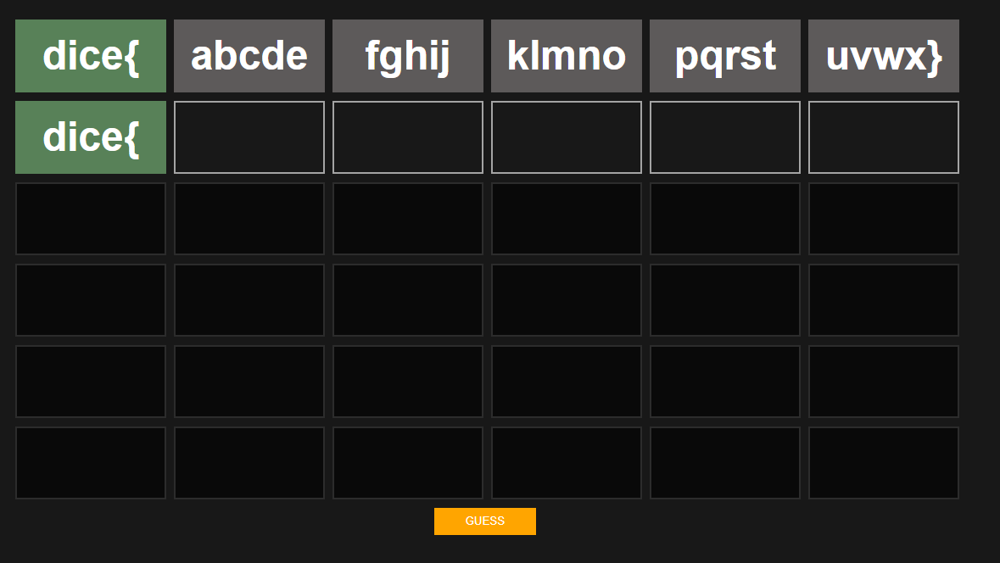
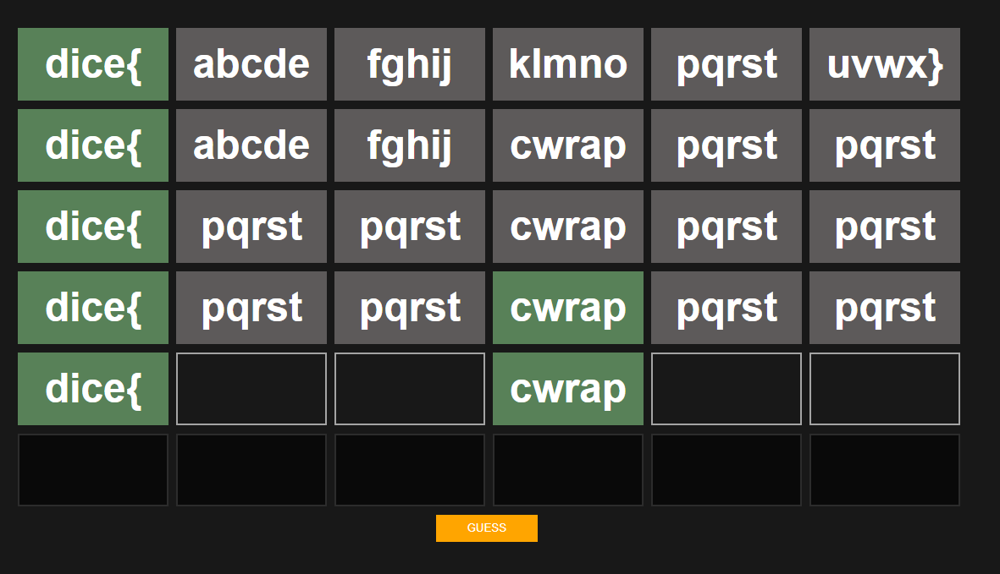

# DiceCTF flagle Write Up

## Details:

Jeopardy style CTF

Category: Reverse Engineering

## Write up:

When we open the link that they provided we can see that the website is a game similar to the popular game wordle. Messing with the page a bit you can see that each of the 6 blocks takes in a maximum of 5 characters:



Looking at the code of the index.html we see the following script:

```js
<script>
    const guess = Module.cwrap('guess', 'number', ['number', 'string']);
    const CORRECT = 0;
    const WRONG_LOCATION = 1;
    const INCORRECT = 2;

    const alphabet = "abcdefghijklmnopqrstuvwxyzABCDEFGHIJKLMNOPQRSTUVWXYZ0123456789!#$%&()*+,-./:;<=>?@[]^_{|}~";

    const get_input = (guess_idx, letter_idx) => {
        return document.querySelector(`[data-guess="${guess_idx}"][data-letter="${letter_idx}"]`)
    };

    const keydown_listener = (e) => {
        const target = e.target;
        const guess_idx = +target.dataset.guess;
        const letter_idx = +target.dataset.letter;

        if (e.modifiers?.length > 0) {
            return;
        }

        if (e.key.length === 1 && !alphabet.includes(e.key)) {
            e.preventDefault();
            return false;
        }

        if (e.key === "Backspace" && target.value.length === 0 && letter_idx > 1) {
            get_input(guess_idx, letter_idx - 1).focus();
        } else if (e.key === "Delete" && target.value.length === 0 && letter_idx < 6) {
            const elem = get_input(guess_idx, letter_idx + 1);
            elem.focus();
            elem.setSelectionRange(0, 0);
            e.preventDefault();
            return false;
        } else if (e.key.length === 1 && target.value.length === 5 && letter_idx < 6) {
            get_input(guess_idx, letter_idx + 1).focus();
        } else if (e.key === "Enter") {
            submit_guess();
        }
    };

    let current_guess = 1;
    const guess_button = document.getElementById('guess-button');

    const submit_guess = () => {
        let correct = 0;
        let input_text = '';
        for (let i = 1; i <= 6; ++i) {
            const el = get_input(current_guess, i);

            const guess_val = el.value;
            input_text += guess_val;

            const result = guess(i, guess_val);
            console.log(result, guess_val, i, guess_val);
            if (result === CORRECT) {
                el.classList.add('correct');
                if (current_guess < 6) {
                    const next = get_input(current_guess + 1, i);
                    next.value = guess_val;
                    next.classList.add('correct');
                }
                correct++;
            } else if (result === WRONG_LOCATION) {
                el.classList.add('partial');
            } else if (result === INCORRECT) {
                el.classList.add('incorrect');
            }

            el.disabled = true;
            el.removeEventListener('keydown', keydown_listener);
        }
        current_guess++;

        if (correct === 6) {
            prompt('Congrats! Here\'s your flag:', input_text);
        }

        if (current_guess > 6) {
            guess_button.disabled = true;
        } else {
            init_guess();
        }
    };
    guess_button.onclick = submit_guess;

    const init_guess = () => {
        for (let i = 1; i <= 6; ++i) {
            const el = get_input(current_guess, i);
            if (!el.classList.contains('correct'))
                el.disabled = false;
            el.addEventListener('keydown', keydown_listener);
        }
    };
    init_guess();
</script>
```

From this we know that we need to find a function named guess and we need to start reversing that function. In the flag-checker.js we can see `var _guess = Module["_guess"] = createExportWrapper("guess");` and right below that we can also see that this was compiled by [emscripten](https://emscripten.org/). This means that we need to look at the wasm file.  

After downloading the .wasm file we need to decompile it, I chose to do this using [wabt](https://github.com/WebAssembly/wabt). The first step for this was to decode from base64 which it was downloaded to:

```
cat flag-checker.wasm | base64 -d >> b64-flag-checker.wasm
```

Then after that I ran the decompiler:

```
./wasm-decompile b64-flag-checker.wasm -o out.wasm
```

Opening out.wasm I see the following:

```wasm
export memory memory(initial: 256, max: 256);

global g_a:int = 5244000;
global g_b:int = 0;
global g_c:int = 0;

export table indirect_function_table:funcref(min: 1, max: 1);

data d_a(offset: 1024) = "dice{\00";
data d_b(offset: 1030) = "";

import function env_validate_4(a:int):int;

export function wasm_call_ctors() {
  emscripten_stack_init()
}

export function a():int {
  return 1684628325
}

export function streq(a:ubyte_ptr, b:ubyte_ptr):int {
  var c:int;
  return loop L_a {
           c = a[0];
           if (c) goto B_b;
           if (b[0]) goto B_b;
           return 1;
           label B_b:
           if (c == b[0]) goto B_c;
           return 0;
           label B_c:
           b = b + 1;
           a = a + 1;
           continue L_a;
         }
}

export function validate_1(a:int):int {
  return streq(a, 1024)
}

function validate(a:int, b:int, c:int, d:int, e:int):int {
  var f:int = g_a - 16;
  f[15]:byte = a;
  f[14]:byte = b;
  f[13]:byte = c;
  f[12]:byte = d;
  d = f[14]:ubyte;
  f[14]:byte = f[13]:ubyte;
  f[13]:byte = d;
  d = f[13]:ubyte;
  f[13]:byte = f[12]:ubyte;
  f[12]:byte = d;
  d = f[13]:ubyte;
  f[13]:byte = f[15]:ubyte;
  f[15]:byte = d;
  d = f[13]:ubyte;
  f[13]:byte = f[12]:ubyte;
  f[12]:byte = d;
  d = f[15]:ubyte;
  f[15]:byte = f[14]:ubyte;
  f[14]:byte = d;
  d = 0;
  if (f[15]:ubyte != 51) goto B_a;
  if (f[14]:ubyte != 108) goto B_a;
  if (f[13]:ubyte != 33) goto B_a;
  d = e == 68 & f[12]:ubyte == 70;
  label B_a:
  return d;
}

export function validate_3(a:int, b:int, c:int, d:int, e:int):int {
  var f:int = 0;
  if (b * a != 4800) goto B_a;
  if (c + a != 178) goto B_a;
  if (c + b != 126) goto B_a;
  if (d * c != 9126) goto B_a;
  if (d - e != 62) goto B_a;
  f = c * 4800 - e * d == 367965;
  label B_a:
  return f;
}

export function validate_5(a:int, b:int, c:int, d:int, e:int):int {
  var f:int = g_a - 16;
  f[15]:byte = a;
  f[14]:byte = b;
  f[13]:byte = c;
  f[12]:byte = d;
  f[15]:byte = f[15]:ubyte + 12;
  f[14]:byte = f[14]:ubyte + 4;
  f[13]:byte = f[13]:ubyte + 6;
  f[12]:byte = f[12]:ubyte + 2;
  d = 0;
  if (f[15]:ubyte != 121) goto B_a;
  if (f[14]:ubyte != 68) goto B_a;
  if (f[13]:ubyte != 126) goto B_a;
  d = e == 77 & f[12]:ubyte == 35;
  label B_a:
  return d;
}

export function validate_6(a:int, b:int, c:int, d:int, e:int):int {
  var f:int = 0;
  if ((b + 2933) * (a + 1763) != 5483743) goto B_a;
  f = e == 125 & (d + 1546) * (c + 3913) == 6431119;
  label B_a:
  return f;
}

export function guess(a:int, b:int):int {
  var c:int = g_a - 16;
  g_a = c;
  var d:int = 2;
  if (f_k(b) != 5) goto B_a;
  if (eqz(streq(b, 1024))) goto B_b;
  d = a != 1;
  goto B_a;
  label B_b:
  var e:int = b[4]:ubyte;
  d = b[3]:ubyte;
  var f:int = b[2]:ubyte;
  var g:int = b[1]:ubyte;
  c[11]:byte = b[0]:ubyte;
  c[10]:byte = g;
  c[9]:byte = f;
  c[8]:byte = d;
  d = c[10]:ubyte;
  c[10]:byte = c[9]:ubyte;
  c[9]:byte = d;
  d = c[9]:ubyte;
  c[9]:byte = c[8]:ubyte;
  c[8]:byte = d;
  d = c[9]:ubyte;
  c[9]:byte = c[11]:ubyte;
  c[11]:byte = d;
  d = c[9]:ubyte;
  c[9]:byte = c[8]:ubyte;
  c[8]:byte = d;
  d = c[11]:ubyte;
  c[11]:byte = c[10]:ubyte;
  c[10]:byte = d;
  if (c[11]:ubyte != 51) goto B_c;
  if (c[10]:ubyte != 108) goto B_c;
  if (c[9]:ubyte != 33) goto B_c;
  d = c[8]:ubyte;
  if ((e & 255) != 68) goto B_c;
  if ((d & 255) != 70) goto B_c;
  d = a != 2;
  goto B_a;
  label B_c:
  f = b[1]:byte;
  if (f * (d = b[0]:byte) != 4800) goto B_d;
  g = b[2]:byte;
  if (g + d != 178) goto B_d;
  if (g + f != 126) goto B_d;
  if (g * (d = b[3]:byte) != 9126) goto B_d;
  if (d - (f = b[4]:byte) != 62) goto B_d;
  if (g * 4800 - f * d != 367965) goto B_d;
  d = a != 3;
  goto B_a;
  label B_d:
  if (eqz(env_validate_4(b))) goto B_e;
  d = a != 4;
  goto B_a;
  label B_e:
  var h:int = b[4]:ubyte;
  g = b[3]:byte;
  e = b[2]:byte;
  f = b[1]:byte;
  c[15]:byte = (b = b[0]:byte);
  c[14]:byte = f;
  c[13]:byte = e;
  c[12]:byte = g;
  c[15]:byte = c[15]:ubyte + 12;
  c[14]:byte = c[14]:ubyte + 4;
  c[13]:byte = c[13]:ubyte + 6;
  c[12]:byte = c[12]:ubyte + 2;
  if (c[15]:ubyte != 121) goto B_f;
  if (c[14]:ubyte != 68) goto B_f;
  if (c[13]:ubyte != 126) goto B_f;
  d = c[12]:ubyte;
  if ((h & 255) != 77) goto B_f;
  if ((d & 255) != 35) goto B_f;
  d = a != 5;
  goto B_a;
  label B_f:
  d = 2;
  if ((f + 2933) * (b + 1763) != 5483743) goto B_a;
  if ((h & 255) != 125) goto B_a;
  if ((g + 1546) * (e + 3913) != 6431119) goto B_a;
  d = a != 6;
  label B_a:
  g_a = c + 16;
  return d;
}

function f_k(a:int):int {
  var d:int;
  var c:int;
  var b:ubyte_ptr = a;
  if (eqz(a & 3)) goto B_b;
  b = a;
  loop L_c {
    if (eqz(b[0])) goto B_a;
    b = b + 1;
    if (b & 3) continue L_c;
  }
  label B_b:
  loop L_d {
    c = b;
    b = c + 4;
    d = c[0]:int;
    if (eqz(((d ^ -1) & d + -16843009) & -2139062144)) continue L_d;
  }
  if (d & 255) goto B_e;
  return c - a;
  label B_e:
  loop L_f {
    d = c[1]:ubyte;
    b = c + 1;
    c = b;
    if (d) continue L_f;
  }
  label B_a:
  return b - a;
}

export function stackSave():int {
  return g_a
}

export function stackRestore(a:int) {
  g_a = a
}

export function stackAlloc(a:int):int {
  var b:int = g_a - a & -16;
  g_a = b;
  return b;
}

export function emscripten_stack_init() {
  g_c = 5244000;
  g_b = 1112 + 15 & -16;
}

export function emscripten_stack_get_free():int {
  return g_a - g_b
}

export function emscripten_stack_get_end():int {
  return g_b
}

export function errno_location():int {
  return 1096
}

function f_s(a:int) {
}

function f(a:int) {
}

function f_u():int {
  f_s(1100);
  return 1104;
}

function f_v() {
  f(1100)
}

function f_w(a:int):int {
  return 1
}

function f_x(a:int) {
}

export function fflush(a:int):int {
  var c:int;
  var b:int;
  var d:int;
  if (a) goto B_a;
  b = 0;
  if (eqz(0[277]:int)) goto B_b;
  b = fflush(0[277]:int);
  label B_b:
  if (eqz(0[277]:int)) goto B_c;
  b = fflush(0[277]:int) | b;
  label B_c:
  a = f_u()[0]:int;
  if (eqz(a)) goto B_d;
  loop L_e {
    c = 0;
    if (a[19]:int < 0) goto B_f;
    c = f_w(a);
    label B_f:
    if (a[5]:int == a[7]:int) goto B_g;
    b = fflush(a) | b;
    label B_g:
    if (eqz(c)) goto B_h;
    f_x(a);
    label B_h:
    a = a[14]:int;
    if (a) continue L_e;
  }
  label B_d:
  f_v();
  return b;
  label B_a:
  c = 0;
  if (a[19]:int < 0) goto B_i;
  c = f_w(a);
  label B_i:
  if (a[5]:int == a[7]:int) goto B_l;
  call_indirect(a, 0, 0, a[9]:int);
  if (a[5]:int) goto B_l;
  b = -1;
  if (c) goto B_k;
  goto B_j;
  label B_l:
  b = a[1]:int;
  if (b == (d = a[2]:int)) goto B_m;
  call_indirect(a, i64_extend_i32_s(b - d), 1, a[10]:int);
  label B_m:
  b = 0;
  a[7]:int = 0;
  a[2]:long = 0L;
  a[1]:long@4 = 0L;
  if (eqz(c)) goto B_j;
  label B_k:
  f_x(a);
  label B_j:
  return b;
}
```

Here we see a lot of functions as well as guess, I decided to focus on the 6 validation functions:

```
export function validate_1(a:int):int {
  return streq(a, 1024)
}
```

The first validation function seems to do some string equals function with what we are given and the data at offset 1024 which we can see is equal to "dice{"

```
data d_a(offset: 1024) = "dice{\00";
```

After that it was time to move to the second validation function:

```
function validate(a:int, b:int, c:int, d:int, e:int):int {
  var f:int = g_a - 16;
  f[15]:byte = a;
  f[14]:byte = b;
  f[13]:byte = c;
  f[12]:byte = d;
  d = f[14]:ubyte;
  f[14]:byte = f[13]:ubyte;
  f[13]:byte = d;
  d = f[13]:ubyte;
  f[13]:byte = f[12]:ubyte;
  f[12]:byte = d;
  d = f[13]:ubyte;
  f[13]:byte = f[15]:ubyte;
  f[15]:byte = d;
  d = f[13]:ubyte;
  f[13]:byte = f[12]:ubyte;
  f[12]:byte = d;
  d = f[15]:ubyte;
  f[15]:byte = f[14]:ubyte;
  f[14]:byte = d;
  d = 0;
  if (f[15]:ubyte != 51) goto B_a;
  if (f[14]:ubyte != 108) goto B_a;
  if (f[13]:ubyte != 33) goto B_a;
  d = e == 68 & f[12]:ubyte == 70;
  label B_a:
  return d;
}
```

This function takes in the 5 characters, shuffles them around a bit, and then compares them against several values. We know that e is the last character so we know that the last value in our 5 character array is 68. Following all the assignments we can figure out that the other values, in order, are: `[70, 33, 51, 108, 68]` or as ascii characters, `F!3lD`.

Now we can move on to the third validation function:

```
export function validate_3(a:int, b:int, c:int, d:int, e:int):int {
  var f:int = 0;
  if (b * a != 4800) goto B_a;
  if (c + a != 178) goto B_a;
  if (c + b != 126) goto B_a;
  if (d * c != 9126) goto B_a;
  if (d - e != 62) goto B_a;
  f = c * 4800 - e * d == 367965;
  label B_a:
  return f;
}
```

This function also takes in 5 characters and performs some checks based on operations with each other. This makes this function a perfect candidate for using Z3py so I started setting up a script with the constraints for this function and the values I found in the earlier validation functions:

```py
from z3 import *

v1 = "dice{"

v2 = [70, 33, 51, 108, 68]

a3 = Int("a3")
b3 = Int("b3")
c3 = Int("c3")
d3 = Int("e3")
e3 = Int("d3")

s = Solver()

s.add(b3 * a3 == 4800)
s.add(c3 + a3 == 178)
s.add(c3 + b3 == 126)
s.add(d3 * c3 == 9126)
s.add(d3 - e3 == 62)
s.add((c3 * 4800) - (e3 * d3) == 367965)
```

I then decided to continue on to the next validation function:

```
import function env_validate_4(a:int):int;
```

This function seemed to call a function that wasn't in the wasm so I looked around and found it in the flag-checker.js which then called a function called c from script.js:

```js
function validate_4(a){ return c(UTF8ToString(a)) == 0 ? 0 : 1; }
```

```js
function c(b) {
    var e = {
            'HLPDd': function(g, h) {
                return g === h;
            },
            'tIDVT': function(g, h) {
                return g(h);
            },
            'QIMdf': function(g, h) {
                return g - h;
            },
            'FIzyt': 'int',
            'oRXGA': function(g, h) {
                return g << h;
            },
            'AMINk': function(g, h) {
                return g & h;
            }
        },
        f = current_guess;
    try {
        let g = e['HLPDd'](btoa(e['tIDVT'](intArrayToString, window[b](b[e['QIMdf'](f, 0x26f4 + 0x1014 + -0x3707 * 0x1)], e['FIzyt'])()['toString'](e['oRXGA'](e['AMINk'](f, -0x1a3 * -0x15 + 0x82e * -0x1 + -0x1a2d), 0x124d + -0x1aca + 0x87f))['match'](/.{2}/g)['map'](h => parseInt(h, f * f)))), 'ZGljZQ==') ? -0x1 * 0x1d45 + 0x2110 + -0x3ca : -0x9 * 0x295 + -0x15 * -0x3 + 0x36 * 0x6d;
    } catch {
        return 0x1b3c + -0xc9 * 0x2f + -0x19 * -0x63;
    }
}
```

This function was pretty ugly so I started off by cleaning up the function. I did this by first taking all of the long calculations and simplifying them, then I renamed the array access to be "functions":

```js
function Func(b) {
    var e = {
            'HLPDd': functionA(g, h) {
                return g === h;
            },
            'tIDVT': functionB(g, h) {
                return g(h);
            },
            'QIMdf': functionC(g, h) {
                return g - h;
            },
            'FIzyt': 'int',
            'oRXGA': functionD(g, h) {
                return g << h;
            },
            'AMINk': functionE(g, h) {
                return g & h;
            }
        },
        f = current_guess;
    try {
        let g = functionA(btoa(functionB(intArrayToString, window[b](b[functionC(f, 1)], 'int')()['toString'](functionD(functionE(f, 4), 2))['match'](/.{2}/g)['map'](h => parseInt(h, f * f)))), 'ZGljZQ==') ? 1 : 0;
    } catch {
        return 0;
    }
}
```

I then cleaned this up by evaluating some of the functions:

- I knew that 'ZGljZQ==' was base64 for dice so I knew our f*f would need to equal 16 since we want to evaulate hex values.
- From here I could then evaluate `functionE(f, 4)` to equal 4, `functionD(4, 2)` to 16, and `functionC(f, 1)` to 3.
- Followed functionB to have it call the function with the correct value.
- And evaluated the two values in functionA to compare the two values.

This cleaned up the code to:

```js
btoa(intArrayToString(window[b](b[3], 'int')()['toString'](16)['match'](/.{2}/g)['map'](h => parseInt(h, 16)))) === 'ZGljZQ=='
```

Earlier when I was looking through the wasm I had noticed a function named a that returned dice:

```
export function a():int {
  return 1684628325
}
```

This meant that I would need to call this function somehow so whatever b was needed to have 'a' as its 4th character. b also needed to be a function in window that only had 5 characters. I then wrote the following snippet to find all the possible values:

```js
Object.getOwnPropertyNames(window).filter(x=> {if (x.length == 5 && x[3] == 'a') console.log(x)})
```

When run in the browser this gave me the following options:

```
Array
isNaN
XRRay
cwrap
clear
```

The only function that took two parameters from the above was `cwrap`. I then tried checking if this was right in the flag checker, but since it was dependent on what guess it only showed as correct on the fourth guess:



After this I moved on to the 5th validation function:

```
export function validate_5(a:int, b:int, c:int, d:int, e:int):int {
  var f:int = g_a - 16;
  f[15]:byte = a;
  f[14]:byte = b;
  f[13]:byte = c;
  f[12]:byte = d;
  f[15]:byte = f[15]:ubyte + 12;
  f[14]:byte = f[14]:ubyte + 4;
  f[13]:byte = f[13]:ubyte + 6;
  f[12]:byte = f[12]:ubyte + 2;
  d = 0;
  if (f[15]:ubyte != 121) goto B_a;
  if (f[14]:ubyte != 68) goto B_a;
  if (f[13]:ubyte != 126) goto B_a;
  d = e == 77 & f[12]:ubyte == 35;
  label B_a:
  return d;
}
```

This was like the second validation function so we just needed to get the values once again, for this part of the flag it was `m@x!M`.

And finally I moved to the final validation function:

```
export function validate_6(a:int, b:int, c:int, d:int, e:int):int {
  var f:int = 0;
  if ((b + 2933) * (a + 1763) != 5483743) goto B_a;
  f = e == 125 & (d + 1546) * (c + 3913) == 6431119;
  label B_a:
  return f;
}
```

For this I once again had to make some Z3 constraints:

```py
s.add((b6 + 2933) * (a6 + 1763) == 5483743)
s.add((d6 + 1546) * (c6 + 3913) == 6431119)
s.add(e6 == 125)

s.add(a6 > 32)
s.add(a6 < 127)
s.add(b6 > 32)
s.add(b6 < 127)
s.add(c6 > 32)
s.add(c6 < 127)
s.add(d6 > 32)
s.add(d6 < 127)
s.add(e6 > 32)
s.add(e6 < 127)
```


Once I had all the components I finished my script:

```py
from z3 import *

# v1 
v1 = "dice{"

# v2
v2 = [70, 33, 51, 108, 68]

# initialize solver
s = Solver()

# v3 values
a3 = Int("a3")
b3 = Int("b3")
c3 = Int("c3")
d3 = Int("e3")
e3 = Int("d3")

# v3 constraints
s.add(b3 * a3 == 4800)
s.add(c3 + a3 == 178)
s.add(c3 + b3 == 126)
s.add(d3 * c3 == 9126)
s.add(d3 - e3 == 62)
s.add((c3 * 4800) - (e3 * d3) == 367965)

# v4
v4 = 'cwrap'

# v5
v5 = "m@x!M"

# v6 values
a6 = Int("a6")
b6 = Int("b6")
c6 = Int("c6")
d6 = Int("e6")
e6 = Int("d6")

# v6 constraints
s.add((b6 + 2933) * (a6 + 1763) == 5483743)
s.add((d6 + 1546) * (c6 + 3913) == 6431119)
s.add(e6 == 125)

# v6 character bounds check
s.add(a6 > 32)
s.add(a6 < 127)
s.add(b6 > 32)
s.add(b6 < 127)
s.add(c6 > 32)
s.add(c6 < 127)
s.add(d6 > 32)
s.add(d6 < 127)
s.add(e6 > 32)
s.add(e6 < 127)

# check our contraints
s.check()

# get the model
m = s.model()

# Get the v3 values
v3 = ''
for i in [a3, b3, c3, d3, e3]:
    v3 += chr(int(str(m[i])))


# Get the v6 values
v6 = ''
for i in [a6, b6, c6, d6, e6]:
    v6 += chr(int(str(m[i])))

# Add all of the flag parts together
flag = v1 + ''.join([chr(i) for i in v2]) + v3 + v4 + v5 + v6

# print the flag
print(flag)
```

When run I got:

```
dice{F!3lDd0Nu7cwrapm@x!MT$r3}
```