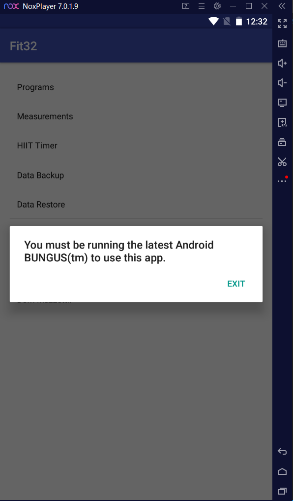

# Trellix Killer App Write Up

## Details:

Jeopardy style CTF

Category: Reverse Engineering

Comments:

```
After some recon and social engineering, Catmen has discovered an app that all the K9's have on their phones, that on the surface appears to be a harmless "fitness app" - undoubtedly a coverup for something more nefurious. Catmen managed to get her claws on the app, but seems to be having trouble actually running it. Go here to respond to her email ASAP!

NOTE: Your browser may warn you about a certificate error when trying to access the page, this is to be expected until we resolve the issue on our end. Hacking this page is not part of the challenge.
```

## Write up:

From the description it seemed like we would need to somehow fix this apk so that it would run, so my first step was to open the apk in nox to see what currently made it fail:



At this point I needed to find where that window was created so I used an [online decompiler](http://www.javadecompilers.com/) and looked for the string. This string BUNGUS was referenced in HomeActivity.java where it was used to create a new popup:

```java
        aVar.f564a.f532d = getString(R.string.title_activity_home);
        aVar.mo727b(getString(R.string.label_text_button), new C0621b(this));
        aVar.f564a.f539k = false;
        aVar.mo726a().show();
```

My next step from here was to take apart the apk, I did this using apktools. I used the -r option so that it would not decode the resources so I could recompile the apk afterwards:

```
apktool d -f -r Fit32.apk
```

I then went into the smali file for HomeActivity to remove the line that showed the popup:

```smali
    invoke-virtual {v0, v1, v3}, La/a/c/a/h$a;->b(Ljava/lang/CharSequence;Landroid/content/DialogInterface$OnClickListener;)La/a/c/a/h$a;

    .line 54
    iget-object v1, v0, La/a/c/a/h$a;->a:La/a/c/a/b$b;

    const/4 v3, 0x0

    iput-boolean v3, v1, La/a/c/a/b$b;->k:Z

    .line 55
    invoke-virtual {v0}, La/a/c/a/h$a;->a()La/a/c/a/h;

    move-result-object v0

    invoke-virtual {v0}, Landroid/app/Dialog;->show()V

    return-void
.end method
```

I then removed all of the lines that corresponded to line 55, recompiled the application, and signed it using apksigner:

```
apktool d Fit32/
java -jar apksigner sign -ks key.jks Fit32.apk
```

Once signed I uploaded the apk to the website and got the flag:

```
ATR[0K_C0MPUT3R_PARAN01D_ANDR01D]
```