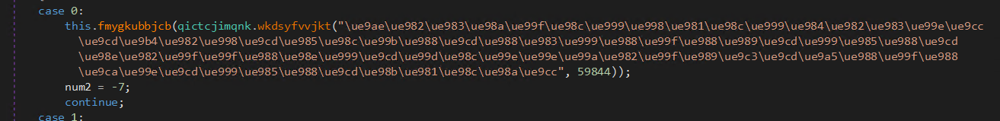
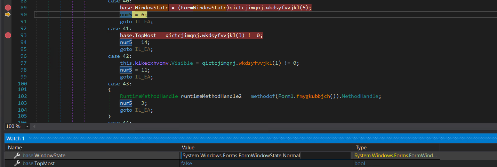

# CyberGon Hollywood Write Up

## Details:

Jeopardy style CTF

Category: Reverse Engineering

Comments:

```t
Hack Like Hollywood
```

## Write up:

After unzipping the zip file I saw that there was an exe, so I checked to see if there were any strings showing that it was C#:

```t
$ strings Nuke.exe | grep NET
NETG
.NETFramework,Version=v4.8
.NET Framework 4.8
```

This meant that I could use dnSpy to decompile the program. Looking under the main form (Secret Form, Form1), I saw that a lot of the program was obfuscated: 



This seemed like it would evaluate to some sort of string so I decided to try reversing how the strings were decrypted. This function ended up calling another function which looked like the following:

```csharp
public string wkdsyfvvjkw(string ucihwoadwjt, int ucihwoadwjt)
{
	int num = ucihwoadwjt.Length;
	char[] array = ucihwoadwjt.ToCharArray();
	while ((num -= 163199905 ^ 163199904) >= ~(-398739298 - -398739297) << 4)
	{
		array[num] = (char)((int)array[num] ^ ((int)this.vvrdrubedio[ucihwoadwjt & (~-675874878 - 675874862)] | ucihwoadwjt));
	}
	return new string(array);
}
```

`this.vvrdrubedio` seemed fairly annoying to try to reverse statically so I decided to continue with dyanmic reversing. The problem was that the author anticipated this and put in some protections. The first was a debug check which could be bypassed by deleting and recompiling, the second was that the window was set to maximize and always stay on top. To get rid of these, I set breakpoints and would change the values on runtime:



Once I had bypassed these I could then set breakpoints anywhere I wanted in the code base and was able to replicate the above function in python:

```python
answers = [0xAD,0xFB,0x86,0x5D,0x29,0x49,0x2A,0xD7,0x72,0xCC,0x4A,0x31,0xA1,0x44,0x06,0x87]

def restore_string(unicode_string, extra):
    unicode_bytes = bytes(unicode_string, 'utf-16be')
    num = len(unicode_string)
    arr = []
    for x in unicode_string:
        arr.append(chr(ord(x)))

    num -= 1
    while num >= 0:
        arr[num] = chr(ord(arr[num]) ^ ((answers[extra & 15])|extra))
        num -= 1

    out = ''.join([i for i in arr])
    print(out)
```

Once I had reversed the strings I got a clearer view, however there were still two other functions that were used to get numbers:

```csharp
public static int wkdsyfvvjkl(int ucihwoadwjt)
{
	int[] vvrdrubedij = qictcjimqnj.qautpfwfmka.vvrdrubedii.vvrdrubedij;
	return qictcjimqnj.qautpfwfmka.vvrdrubedii.vvrdrubedij[ucihwoadwjt];
}
```

```csharp
internal static int wkdsyfvvjlp(int ucihwoadwjt)
{
	if (ucihwoadwjt <= (~233442834 ^ -233442900))
	{
		switch (ucihwoadwjt - (72107058 - 72107008))
		{
		case 0:
			return ~-518069808 ^ -518069811;
		case 1:
			break;
		case 2:
			return (-(563213124 ^ 686526847) - -307799920) ^ -148784433;
		default:
			switch (ucihwoadwjt - ((~986048383 + 301575129) ^ -684473248))
			{
			case 0:
				return (743704947 + -489808864) ^ -253896162;
			case 2:
				return -(160 << 4 >> 7);
			case 4:
				return ~(12 << 1);
			case 5:
				return 709877006 - 709877252 >> 1;
			case 8:
				return 1038821198 - 81986796 + -496404276 - 460430238;
			}
			break;
		}
	}
	else
	{
		switch (ucihwoadwjt - (((-309708691 - -3206028) ^ -306500807) >> 5))
		{
		case 0:
			return (--295828639 << 1) ^ -591657286;
		case 1:
			return (681416852 + -704626059) ^ 23209208;
		case 2:
			break;
		case 3:
			return (~(~872326184) >> 1) - 436163205;
		default:
			if (ucihwoadwjt == ~(-553073554 ^ 553073601))
			{
				return ~(--255872 >> 7) << 3 >> 7;
			}
			break;
		}
	}
	return (398952530 ^ 504527747) - -252110122 + -417126652;
}
```

The first function ended up just being a lookup table with the values being:

```t
[0]    0x00000004    int
[1]    0x00000000    int
[2]    0x0000006C    int
[3]    0x00000001    int
[4]    0x0000006B    int
[5]    0x00000002    int
[6]    0x00000003    int
[7]    0x000000F3    int
[8]    0x00010000    int
[9]    0x00000005    int
[10]    0x0000027E    int
[11]    0x00000165    int
[12]    0x0000000C    int
[13]    0x00000134    int
[14]    0x0000009D    int
[15]    0x00000138    int
[16]    0x000000A1    int
[17]    0x00000144    int
[18]    0x0000012E    int
[19]    0x00000132    int
[20]    0x000000AD    int
[21]    0x000000AC    int
[22]    0x00000006    int
[23]    0x000000B0    int
[24]    0x00000007    int
[25]    0xFFFFFFFE    int
[26]    0x000001F4    int
[27]    0x00000064    int
[28]    0x00001388    int
[29]    0x000002A1    int
[30]    0x00000096    int
[31]    0x00000020    int
[32]    0x00000BB8    int
[33]    0x0000000A    int
[34]    0x000001C0    int
[35]    0x0000013E    int
[36]    0x000001C2    int
[37]    0x00000140    int
[38]    0x00000032    int
[39]    0x0000000F    int
[40]    0x0000002A    int
[41]    0x0000001F    int
[42]    0x00000023    int
[43]    0x0000000B    int
[44]    0x00000028    int
[45]    0x00000022    int
[46]    0x00000027    int
[47]    0x00000033    int
[48]    0x00000025    int
[49]    0x0000001E    int
[50]    0x0000002B    int
[51]    0x00000021    int
[52]    0x00000029    int
[53]    0x0000002E    int
[54]    0x00000034    int
[55]    0x00000036    int
[56]    0x00000009    int
[57]    0x00000039    int
[58]    0x0000003F    int
[59]    0x00000038    int
[60]    0x0000007D    int
[61]    0x0000003C    int
[62]    0x0000003D    int
[63]    0x0000000E    int
[64]    0x00000040    int
[65]    0x0000004A    int
[66]    0x00000048    int
[67]    0x00000049    int
[68]    0x0000004B    int
[69]    0x00000070    int
[70]    0x00000073    int
[71]    0x00000047    int
[72]    0x0000007E    int
[73]    0x0000004D    int
[74]    0x00000010    int
[75]    0x0000001C    int
[76]    0x00000054    int
```

The second was still fairly easy and just needed to be replicated in python:

```python
def solve(x):
    if x <= (~233442834 ^ -233442900):
        y = x - (72107058 - 72107008)
        if y == 0:
            return ~-518069808 ^ -518069811
        elif y == 1:
            pass
        elif y == 2:
            return (-(563213124 ^ 686526847) - -307799920) ^ -148784433
        else:
            z = (x - ((~986048383 + 301575129) ^ -684473248))
            if z == 0:
                return (743704947 + -489808864) ^ -253896162
            elif z == 2:
                return -(160 << 4 >> 7)
            elif z == 4:
                return ~(12 << 1)
            elif z == 5:
                return 709877006 - 709877252 >> 1
            elif z == 8:
                return 1038821198 - 81986796 + -496404276 - 460430238
    else:
        y = (x - (((-309708691 - -3206028) ^ -306500807) >> 5))
        if y == 0:
            return (295828638 << 1) ^ -591657286
        elif y == 1:
            return (681416852 + -704626059) ^ 23209208
        elif y == 2:
            pass
        elif y == 3:
            return (~(~872326184) >> 1) - 436163205
        else:
            if (x == ~(-553073554 ^ 553073601)):
                return ~(255871 >> 7) << 3 >> 7
    return (398952530 ^ 504527747) - -252110122 + -417126652
```

Once I had replaced all of these I was able to see the important part of the code:

```csharp
bool flag;
if (char.IsLetter((char)ucihwoadwjt.KeyCode))
{
	if (7 <= -44)
	{
		goto IL_239;
	}
	flag = false;
}
else
{
	flag = true;
}
char c;
if (!flag)
{
	bool flag2;
	if (((Control.ModifierKeys & (Keys)0x10000) == (Keys)0x10000) ^ Console.CapsLock)
	{
		if (114 <= 51)
		{
			goto IL_239;
		}
		flag2 = false;
	}
	else
	{
		flag2 = true;
	}
	if (!flag2)
	{
		c = char.ToUpper((char)ucihwoadwjt.KeyCode);
	}
	else
	{
		c = char.ToLower((char)ucihwoadwjt.KeyCode);
	}
}
else
{
	c = (char)ucihwoadwjt.KeyCode;
}
if ((byte)Array.IndexOf<int>(this.klkecxhvcmz, (int)c) == this.klkecxhvcmu[this.klkecxhvcmw][this.klkecxhvcmx])
{
	this.klkecxhvcmx += 0x1;
	for (;;)
	{
		int num = 0x0;
		for (;;)
		{
			switch (num ^ 0x38)
			{
			case 56:
				if (this.klkecxhvcmx == this.klkecxhvcmu[this.klkecxhvcmw].Length)
				{
					num = 1;
					continue;
				}
				return;
			case 57:
				this.show_message(string.Format("Sequence {0} correct!", this.klkecxhvcmw + 0x1));
				num = 0x3;
				continue;
			case 58:
			{
				RuntimeMethodHandle runtimeMethodHandle = methodof(Form1..ctor()).MethodHandle;
				num = 2;
				continue;
			}
			case 59:
				goto IL_138;
			}
			break;
		}
	}
	IL_138:
	for (;;)
	{
		int num2 = -25;
		for (;;)
		{
			num2 ^= 0x36;
			switch (num2 + 50)
			{
			case 0: // num2 == -50
				this.show_message("Congratulations! You have entered the correct password. Here's the flag!");
				num2 = -7;
				continue; //  go to case 1
			case 1:
				this.klkecxhvcmw = 0x0;
				num2 = -30;
				continue; // go to case 6
			case 2:
			{
				RuntimeMethodHandle runtimeMethodHandle2 = methodof(Form1.shutdown_incorrect()).MethodHandle;
				num2 = -26;
				continue;
			}
			case 3:
				this.klkecxhvcmx = 0x0;
				num2 = -28;
				continue; // go to case 4
			case 4:
				this.klkecxhvcmw += 0x1;
				num2 = -27;
				continue; // go to case 5
			case 5:
				if (this.klkecxhvcmw == this.klkecxhvcmu.Length)
				{
					num2 = -8;
					continue;
				}
				return;
			case 6:
				return;
			}
			break;
		}
	}
	return;
}
```

What the code above did was grab the keycode that the user entered, it then checked to see if the index of that key code in an array was equal to the position that it should have in a matrix. If the value was correct it would then increment one of the matrix indices. If all of a "sequence" was correct it would then move on to the next one. At this point all we had to do was extract the array and matrix values and then replicate the code but instead of a comparison just check which character matched up with the matrix:

```python

indexer = [0x00000069,0x00000032,0x00000023,0x0000003A,0x00000050,0x00000037,0x0000005B,0x00000024,0x00000068,0x0000005D,0x00000031,0x00000076,0x0000000B,0x0000007E,0x0000004A,0x0000002F,0x0000003E,0x0000002B,0x0000004F,0x00000066,0x0000005C,0x00000043,0x0000006C,0x00000020,0x0000005E,0x0000000A,0x00000047,0x00000073,0x0000006B,0x00000029,0x00000045,0x0000003F,0x0000005F,0x00000078,0x00000040,0x00000079,0x0000006E,0x00000067,0x00000009,0x00000026,0x00000060,0x00000048,0x0000004E,0x00000052,0x00000059,0x00000039,0x00000041,0x00000053,0x0000000D,0x00000051,0x00000054,0x0000007B,0x0000005A,0x00000065,0x00000044,0x00000035,0x0000003C,0x00000064,0x0000004B,0x0000002C,0x0000002D,0x00000049,0x0000007C,0x00000038,0x0000004C,0x0000002E,0x0000000C,0x00000021,0x00000022,0x00000042,0x00000061,0x0000003B,0x0000003D,0x0000006F,0x00000077,0x0000002A,0x0000004D,0x00000046,0x00000036,0x00000033,0x0000006A,0x0000006D,0x00000057,0x00000030,0x00000058,0x00000055,0x0000007D,0x00000063,0x00000075,0x00000062,0x00000070,0x00000034,0x00000027,0x00000074,0x00000056,0x0000007A,0x00000025,0x00000072,0x00000071,0x00000028]

matrix = [
    [0x08,0x43,0x43,0x53,0x4A,0x20,0x51,0x53,0x24,0x4F,0x5B,0x53,0x43],
    [0x5B,0x24,0x24,0x53,0x53,0x07,0x20,0x16,0x16,0x20,0x16,0x61],
    [0x57,0x25,0x20,0x16,0x53,0x4F,0x57,0x20,0x43,0x61,0x20,0x16],
    [0x1C,0x20,0x08,0x23,0x39,0x4F,0x53,0x58,0x1C,0x4F,0x4A,0x39]
]

def check_character():
    cur_x = 0
    cur_y = 0

    s = ""

    while True:
        check = False
        pos = matrix[cur_x][cur_y]
        c = indexer[pos]
        cur_x += 1
        s += chr(c)
        print(s)
        num = 0x0

        while True:
            if num ^ 0x38 == 56:
                if cur_x == len(matrix):
                    num = 1
                else:
                    break
            elif num ^ 0x38 == 57:
                print("sequence", cur_y+1, "correct")
                # print(s)
                # s = ""
                num = 0x3
            elif num ^ 0x38 == 58:
                print("Failed")
                return
            elif num ^ 0x38 == 59:
                print("Success")
                check = True
                break

        if check:
            num2 = -25
            cur_x = 0
            cur_y += 1

check_character()
```

When run this program then gave us the flag:

```t
h4ck!ng_!n_h00lyw00d_$33m_c00l_unl!k3_r34l_w0rld!
```