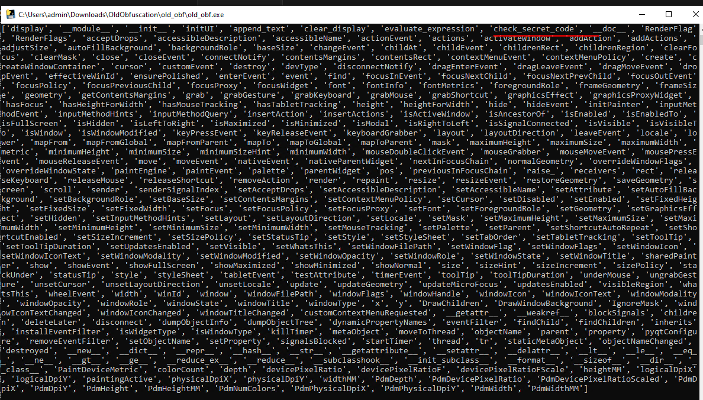
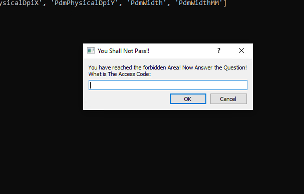
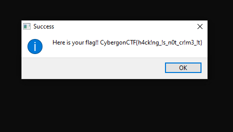

# CyberGon Old Obfuscation Write Up

## Details:

Jeopardy style CTF

Category: Reverse Engineering

Comments:

```t
There is a spell, kept lock in the secret vault of Cyber Gon because of it's destructive power, will u able to solve it.
```

## Write up:

After unzipping the file I saw both compiled python files as well as an exe. This led me to believe that the program was compiled with pyinstaller. To be sure, I ran strings:

```t
$ strings old_obf.exe | grep -i pyinstaller
Cannot open PyInstaller archive from executable (%s) or external archive (%s)
PYINSTALLER_STRICT_UNPACK_MODE
PyInstaller: FormatMessageW failed.
PyInstaller: pyi_win32_utils_to_utf8 failed.
```

Once I knew that it was pyinstaller, I then used the [pyinstxtractor](https://github.com/extremecoders-re/pyinstxtractor) to extract the pyc files and ran a decompiler on old_obf.pyc:

```python
# Source Generated with Decompyle++
# File: old_obf.pyc (Python 3.7)

from pytransform import pyarmor_runtime
pyarmor_runtime()
__pyarmor__(__name__, __file__, b'PYARMOR\x00...\x90\x95', 1)
```

I saw that the program used something called pyarmor to run some sort of encrypted code. After some googling I came across a tool called PyArmor Unpacker that had a [script](https://github.com/Svenskithesource/PyArmor-Unpacker/blob/main/methods/method%202/code.py) that you could inject into the exe to leak information. 

After following the instructions on the readme I ended up with a new pyc for the exe that wouldn't decompile, but that looked incomplete when disassembled:

```python
    [Disassembly]
        0       <INVALID>                     
        2       <INVALID>                     
        4       IMPORT_NAME                   0: sys
        6       STORE_NAME                    0: sys
        8       <INVALID>                     
        10      <INVALID>                     
        12      IMPORT_NAME                   1: PyQt5.QtWidgets
        14      IMPORT_FROM                   2: QApplication
        16      STORE_NAME                    2: QApplication
        18      IMPORT_FROM                   3: QWidget
        20      STORE_NAME                    3: QWidget
        22      IMPORT_FROM                   4: QVBoxLayout
        24      STORE_NAME                    4: QVBoxLayout
        26      IMPORT_FROM                   5: QLineEdit
        28      STORE_NAME                    5: QLineEdit
        30      IMPORT_FROM                   6: QPushButton
        32      STORE_NAME                    6: QPushButton
        34      IMPORT_FROM                   7: QGridLayout
        36      STORE_NAME                    7: QGridLayout
        38      IMPORT_FROM                   8: QInputDialog
        40      STORE_NAME                    8: QInputDialog
        42      IMPORT_FROM                   9: QMessageBox
        44      STORE_NAME                    9: QMessageBox
        46      POP_TOP                       
        48      LOAD_BUILD_CLASS              
        50      <INVALID>                     
        52      <INVALID>                     
        54      MAKE_FUNCTION                 0
        56      <INVALID>                     
        58      LOAD_NAME                     3: QWidget
        60      CALL_FUNCTION                 3
        62      STORE_NAME                    10: Calculator
        64      LOAD_NAME                     11: __name__
        66      <INVALID>                     
        68      COMPARE_OP                    2 (==)
        70      POP_JUMP_IF_FALSE             110
        72      LOAD_NAME                     2: QApplication
        74      LOAD_NAME                     0: sys
        76      LOAD_ATTR                     12: argv
        78      CALL_FUNCTION                 1
        80      STORE_NAME                    13: app
        82      LOAD_NAME                     10: Calculator
        84      CALL_FUNCTION                 0
        86      STORE_NAME                    14: calc
        88      LOAD_NAME                     14: calc
        90      LOAD_METHOD                   15: show
        92      CALL_METHOD                   0
        94      POP_TOP                       
        96      LOAD_NAME                     0: sys
        98      LOAD_METHOD                   16: exit
        100     LOAD_NAME                     13: app
        102     LOAD_METHOD                   17: exec_
        104     CALL_METHOD                   0
        106     CALL_METHOD                   1
        108     POP_TOP                       
        110     <INVALID>                     
        112     RETURN_VALUE 
```

I then read back through the readme and started modifying the injected script so that I could start exploring more of the program. I saw that an object called calc was in the globals so I decided to run `__dir__()` on it to see what I could find. To do this I added the following code right before marshal_to_pyc was called:

```python
print(frame.f_globals["calc"].__dir__())
```

Once injected I was able to see all of the classes attributes:



In these attributes I saw an interesting function called `check_secret_code`, so my next step was to call the function. To do this I once again modified the injectable script:

```python
print(frame.f_globals["calc"].check_secret_code())
```

When I injected the code I then saw this popup come up:



After entering random stuff and pressing enter I then had another popup come up, sadly this one had the wrong flag:



From here I then decided to instead try to extract the code from the function. Luckily, the script already had all the functions I needed to get around pyarmor so I could generate pyc files with the following additions:

```python
marshal_to_pyc(DUMP_DIR / "check.pyc", output_code(frame.f_globals["calc"].check_secret_code.__code__))
```

Once I decompiled the code I had the following:

```python
(password, ok) = None(None, QInputDialog.getText, self)
if ok:
    h3 = http3
    import http3.http3
    flag = h3.check_pass(password)
    if None != flag:
        None(None, None, QMessageBox.information + self + flag)
    else:
        None(None, QMessageBox.warning, self)
self.clear_display()
```

While the code wasn't too helpful, it did tell me that I would need to decompile the function check_pass under the http.http import. I then added the following code to my injectable:

```python
marshal_to_pyc(DUMP_DIR / "checkpass.pyc", output_code(http3.http3.check_pass.__code__))
```

After which point I ended up with the following code:

```python
# Source Generated with Decompyle++
# File: checkpass.pyc (Python 3.7)

SUvbxaNEZXpnzUPXRMNFiObzqpebXcuAclJprToFzfttqZKUdFpHzRBvqCJRWclvcBnPqhbgbMQNSgK1 = ''
for i in range(0, len(password)):
    b2 = open('./http3/sessions/_' + str(i + 1), 'rb')
    zzz = b2.read()
    llII = bytearray()
    llII.append(227)
    for y5 in zzz:
        if y5 == 0:
            llII.append(0)
            continue
        llII.append(y5 ^ ord(password[i]))
    
    import marshal
    handler = handler
    import sessions
    I165018007891490136 = getattr(handler, '_' + str(i + 1))
    
    try:
        VVVVVVV = marshal.loads(llII)
        I165018007891490136.__code__ = VVVVVVV
        SUvbxaNEZXpnzUPXRMNFiObzqpebXcuAclJprToFzfttqZKUdFpHzRBvqCJRWclvcBnPqhbgbMQNSgK1 += chr(I165018007891490136())
    continue
    except Exception:
        e = None
        
        try:
            SUvbxaNEZXpnzUPXRMNFiObzqpebXcuAclJprToFzfttqZKUdFpHzRBvqCJRWclvcBnPqhbgbMQNSgK1 += I165018007891490136()
        finally:
            e = None
            del e

        continue
    


return SUvbxaNEZXpnzUPXRMNFiObzqpebXcuAclJprToFzfttqZKUdFpHzRBvqCJRWclvcBnPqhbgbMQNSgK1
```

At this point, my first step was to clean up the code a bit. To do that I started by renaming some things:

```python
s = ''
for i in range(0, len(password)):
    b2 = open('./http3/sessions/_' + str(i + 1), 'rb')
    file_read = b2.read()
    code_to_load = bytearray()
    code_to_load.append(227)
    for cur_byte in file_read:
        if cur_byte == 0:
            code_to_load.append(0)
            continue
        code_to_load.append(cur_byte ^ ord(password[i]))
    
    import marshal
    handler = handler
    import sessions
    get_char = getattr(handler, '_' + str(i + 1))
    
    try:
        loaded_code = marshal.loads(code_to_load)
        get_char.__code__ = loaded_code
        s += chr(get_char())
    continue
    except Exception:
        e = None
        
        try:
            s += get_char()
        finally:
            e = None
            del e

        continue

return s
```

Now that the code was cleaned up I saw that when a user entered a password, it would go through that password character by character and use that to xor decrypt a file under `./http3/sessions`. It would then load that code with marshal and use that to get the character. 

To solve this challenge, I decided to brute force one character at a time, since a wrong character would cause the code to be loaded incorrectly. I had some issues running the code object loaded from marshal so I ended up using dis.dis to disassemble the code and piping the stdout output to a variable so I could extract the character needed. 

Each code block, once disassembled looked like:

```python
  2           0 LOAD_CONST               1 (52)
              2 RETURN_VALUE
```

So then I parsed the output to grab the character value. From there I was able to write the solve script:


```python
def solve(password):
    s = ''
    for i in range(0, len(password)):
        b2 = open('./sessions/_' + str(i + 1), 'rb')
        file_read = b2.read()
        code_to_load = bytearray()
        code_to_load.append(227)
        for cur_byte in file_read:
            if cur_byte == 0:
                code_to_load.append(0)
                continue
            code_to_load.append(cur_byte ^ ord(password[i]))
        
        import marshal
        import sessions
        import dis
        import sys
        import io
        try:
            loaded_code = marshal.loads(code_to_load)
            stdout = sys.stdout 
            f = io.StringIO()
            sys.stdout = f 
            dis.dis(loaded_code)
            sys.stdout = stdout
            code = f.getvalue().split("\n")[0].split("(")[1].split(")")[0]
            s += chr(int(code))
            continue
        except Exception as e:
            return False
    print(s)
    return True

array = [0]
while len(array) < 46:
    password = ''.join([chr(a) for a in array])
    if solve(password) == False:
        array[len(array)-1] += 1
    else:
        print(password)
        array.append(0)        
```

When run I got the flag:

```t
4b!t_0f_0bfu$sc4t!0n_4nd_4b!t_0f_c0d3_0bj3ct
```